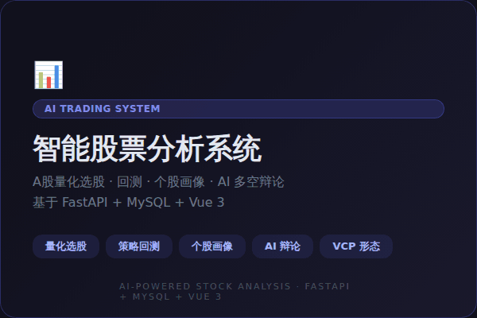
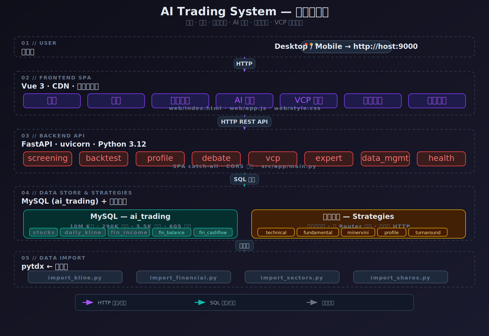

<div align="center">

# AI Trading System

<p align="center">
  
  <br/>
  <sub>动画由 <a href="https://github.com/alchaincyf/huashu-design">huashu-design</a> skill 制作 | <a href="assets/hero-animation.html">查看动画源文件</a></sub>
</p>

> A股量化交易系统 — 选股 · 回测 · 个股画像 · AI 多空辩论

[](https://python.org)
[](https://fastapi.tiangolo.com)
[](https://vuejs.org)
[](https://mysql.com)
[](LICENSE)

[文档](#功能总览) · [快速开始](#快速开始) · [系统架构](#系统架构) · [API 概览](#api-概览)

</div>

---

## 功能总览

| 模块 | 说明 |
|------|------|
| **🔍 量化选股** | MA多头排列、财务指标筛选、Minervini SEPA、困境反转、组合策略 |
| **📈 策略回测** | MA金叉死叉交易系统、自定义持仓P&L、最大回撤、K线可视化 |
| **📋 个股画像** | 九大维度财务分析、张新民六维财报诊断、自动化报告输出 |
| **🧠 AI 多空辩论** | 双Agent辩论模式，多空观点碰撞，辅助投资决策 |
| **📐 VCP 形态识别** | Minervini 波动收缩模式检测，精确识别突破点 |
| **👨‍🏫 专家系统** | 多领域专家知识库查询，财报/技术面/行业分析 |
| **🗄️ 数据管理** | 通达信日K线、财报、板块数据导入，数据可靠性验证 |

---

## 快速开始

### 依赖

- Python 3.12
- MySQL 8.0
- 通达信数据源（用于数据导入）

### 安装

```bash
# 1. Clone
git clone https://github.com/zhitucoder/ai-trading && cd ai-trading

# 2. 虚拟环境
conda create -n aitrading python=3.12
conda activate aitrading
pip install fastapi uvicorn pymysql pytdx

# 3. MySQL 建库
mysql -u root -p -e "CREATE DATABASE IF NOT EXISTS ai_trading"
# 建表脚本参见 src/import_*.py （导入数据时会自动建表）

# 4. 配置数据库连接
# 编辑 src/app/database.py，确认 MySQL 连接参数
```

### 启动

```bash
# 启动 uvicorn 服务器（端口 9000）
setsid /path/to/uvicorn src.app.main:app \
  --host 0.0.0.0 --port 9000 < /dev/null > /tmp/uvicorn.log 2>&1 &
```

浏览器打开 `http://localhost:9000` 即可使用 SPA 界面。

### 数据导入

```bash
# 日K线数据（通达信 .day 文件 → daily_kline 表）
python src/import_kline.py

# 财务数据（利润表/资产负债表/现金流量表等 8 张表）
python src/import_financial.py

# 板块分类
python src/import_sectors.py

# 股本信息
python src/import_shares.py
```

---

## 系统架构



| 层 | 技术栈 |
|----|--------|
| **用户层** | Desktop / Mobile 浏览器 |
| **前端** | Vue 3 (CDN, 无构建工具) · `web/index.html` · `web/app.js` · `web/style.css` |
| **后端** | FastAPI · uvicorn · Python 3.12 · `src/app/main.py` |
| **数据库** | MySQL 8.0 · 10M+ K线 · 290K 财务记录 · 5500+ 股票 |
| **导入层** | pytdx ← 通达信 · 4 个独立导入脚本 |

### 路由注册顺序

API 路由必须在 SPA catch-all 之前注册，否则 catch-all 会拦截 API 请求。

```python
# ✅ 正确：API 路由先声明
app.include_router(screening.router, prefix='/api/screening', tags=['选股'])
app.include_router(backtest.router, prefix='/api', tags=['回测'])
# ... 其他路由 ...
app.include_router(data_management.router, prefix='/api', tags=['数据管理'])

@app.get('/api/health')
def health():
    return {'status': 'ok'}

# ✅ 最后 SPA catch-all
@app.get('/{path:path}')
def serve_spa(path: str = ''):
    ...
```

---

## API 概览

| 端点 | 方法 | 用途 |
|------|------|------|
| `/api/health` | GET | 健康检查 |
| `/api/screening/strategies` | GET | 列出选股策略 |
| `/api/screening/execute` | POST | 执行选股 |
| `/api/kline/{stock_code}?days=N` | GET | 获取OHLCV数据 |
| `/api/kline_range/{stock_code}?start=&end=` | GET | 区间K线数据 |
| `/api/backtest/position` | POST | 自定义持仓回测 |
| `/api/backtest/ma` | POST | MA金叉死叉回测 |
| `/api/profile/{stock_code}` | GET | 个股画像 |
| `/api/debate/{stock_code}` | GET | AI 多空辩论 |
| `/api/vcp/{stock_code}` | GET | VCP形态检测 |
| `/api/expert/query` | POST | 专家系统查询 |
| `/api/import/status` | GET | 数据导入状态 |
| `/api/import/trigger` | POST | 触发数据导入 |

---

## 选股策略

| 策略 | ID | 说明 |
|------|-----|------|
| **MA多头排列** | `ma_bullish` | MA5 > MA10 > MA20 > MA60（窗口函数计算，参数可配） |
| **全财务筛选** | `fundamental_all` | 营收增长 + 净利增长 + 负债率 < 阈值 |
| **Minervini SEPA** | `minervini` | 趋势模板 + VCP + 相对强度（待完善） |
| **困境反转** | `turnaround` | 财务指标诊断 + 周期判断 |
| **MA + 营收增长** | `ma_bullish_and_revenue_growth` | 先用财务过滤（减少计算量），再算MA，分批500 |

---

## 数据库

### 关键表

| 表 | 行数 | 用途 | 可靠性 |
|----|------|------|--------|
| `stocks` | 5.5K | 股票代码→名称映射 | ✅ 手动维护 |
| `daily_kline` | 10M | 日K线 (OHLCV, 2021-2026) | ✅ 二进制.day直接导入 |
| `fin_income` | 290K | 利润表 | ✅ 收入/成本/利润合理 |
| `fin_balance_sheet` | 290K | 资产负债表 | ✅ 会计恒等式成立 |
| `fin_cash_flow` | 290K | 现金流量表 | ✅ 与收入/BS一致 |
| `fin_ratios` | 290K | 财务比率 | ⚠️ 部分字段偏移损坏 |
| `sectors` | 605 | 板块定义 | ✅ |
| `stock_sectors` | 82K | 股票↔板块映射 | ✅ |

### 指标计算（绕过已损坏的字段）

| 指标 | 正确计算方式 |
|------|-------------|
| 营收增长率 | `fin_income` 自连接：`(当期营收 − 上年同期) / 上年同期 × 100` |
| 净利润增长率 | 同上，取净利润字段 |
| 资产负债率 | `fin_balance_sheet`：`总负债 / 总资产 × 100` |
| 流动比率 | `fin_balance_sheet`：`流动资产 / 流动负债` |
| ROE | `fin_income.净利润 / fin_balance_sheet.净资产 × 100` |
| 毛利率 | `(营收 − 营业成本) / 营收 × 100` |
| 净利率 | `净利润 / 营收 × 100` |

---

## Tech Stack

- **后端**: Python 3.12, FastAPI, uvicorn, pymysql, pytdx
- **前端**: Vue 3 (CDN, 无需构建工具), lightweight-charts
- **数据库**: MySQL 8.0, InnoDB
- **数据源**: 通达信 (通达信金融终端)
- **设计**: huashu-design — @花叔 出品的设计哲学

---

## 仓库结构

```
ai-trading/
├── README.md
├── AGENTS.md                    # Claude Code 指令
├── ai-trading-architecture.png  # 架构图
├── ai-trading-architecture.svg  # 架构图源文件
├── assets/
│   ├── hero.gif                 # 演示动画 GIF
│   ├── hero-animation.html      # 动画源文件
│   └── wechat-qrcode.png        # 公众号二维码
├── src/
│   ├── app/
│   │   ├── main.py              # FastAPI 入口
│   │   ├── database.py          # MySQL 连接
│   │   ├── routers/             # API 路由
│   │   │   ├── screening.py     # 选股
│   │   │   ├── backtest.py      # 回测
│   │   │   ├── profile.py       # 个股画像
│   │   │   ├── debate.py        # AI 辩论
│   │   │   ├── vcp.py           # VCP形态
│   │   │   ├── expert.py        # 专家系统
│   │   │   └── data_management.py
│   │   └── strategies/          # 选股策略
│   │       ├── technical.py     # MA多头排列
│   │       ├── fundamental.py   # 财务筛选
│   │       ├── minervini.py     # SEPA系统
│   │       ├── profile.py       # 画像引擎
│   │       └── turnaround.py    # 困境反转
│   ├── import_kline.py          # K线导入
│   ├── import_financial.py      # 财务导入
│   ├── import_sectors.py        # 板块导入
│   └── import_shares.py         # 股本导入
├── web/
│   ├── index.html               # Vue 3 SPA
│   ├── app.js                   # Vue 组件
│   └── style.css                # 深色主题
├── analysis/                    # 张新民财务分析报告
└── docs/
    └── architecture.md          # 架构文档
```

---

## 关于作者

**zhituCodder** — AI Native Coder，独立开发者

| 平台 | 链接 |
|------|------|
| 🌐 官网 |  |
| 📺 B站 | [浩哥讲大模型与AI应用](https://space.bilibili.com/1235336642) |
| 📕 小红书 | [知途程序员]|
| 💬 CSDN | [星星之火](https://blog.csdn.net/spark_dev) |
| 📮 公众号 | 微信搜「知途程序员知识体系」或扫码关注 ↓ |


<div align="center">

*不破楼兰终不还。*

<br>

MIT License © [zhituCodder](https://github.com/zhitucoder)

</div>
