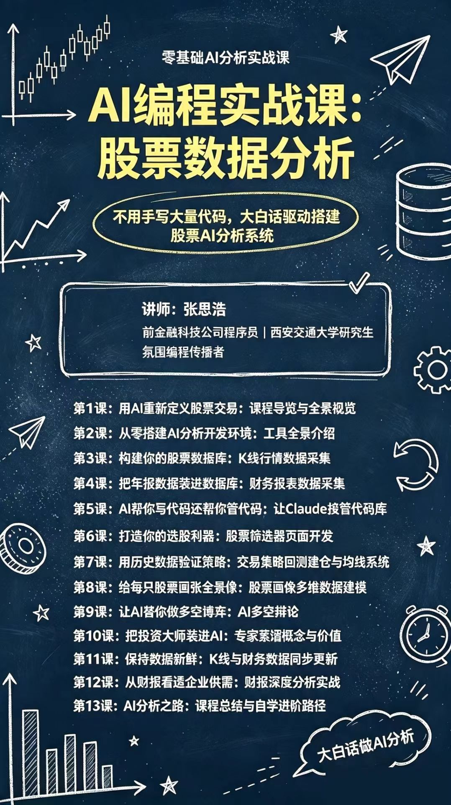
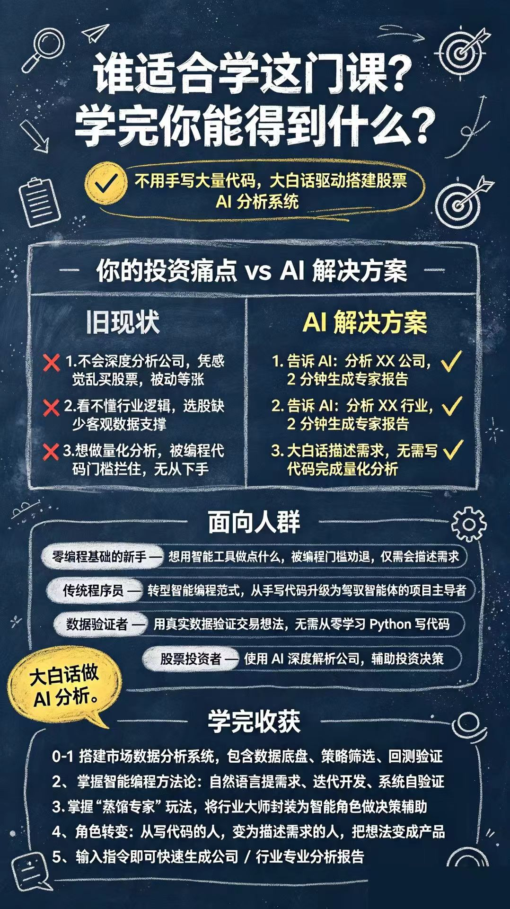

# AI + 证券分析 · 两天学会 AI 编程

**不写一行代码，用 AI 从零搭建一套自己的 A 股数据分析系统**

---

> ⚠️ **免责声明**：本课程中的 AI 分析结果**🔴 仅作为知识分析与学习参考**，**无法取代最终投资判断**。投资有风险，入市需谨慎。**本课程不做任何交易建议。**

---

## 🎯 课程定位

本门课程定位是 **AI 编程课 —— 两天学会 AI 编程**。

编程实操课题为：**股票分析**（**🔴 只做学习研究，不做最终交易建议**）。

AI 是能力的放大器——它帮你扩展知识边界，只做辅助决策，**无法取代你的判断力**。

---

## 👨‍🏫 老师介绍

**张思浩**

- 前金融科技公司程序员
- 西安交通大学研究生
- 氛围编程传播者

---

## 📚 课程内容 · 13 讲

**AI 编程实践课：股票数据分析**

> 📌 详细课程大纲请查看上方的**课程商品详情页**。

---

## 🧑‍💻 面向人群 & 🎓 学完收获

> 📌 面向人群与学完收获，请查看下方的图片。

---

## 📋 课程信息

| 项目 | 说明 |
|------|------|
| **编程工具** | 目前编程界主流工具（Claude Code / OpenCode） |
| **AI 编程风险** | AI 模型幻觉 |
| **上课方式** | 录播视频，随到随学，13 节课（38 节小课，总时长约 8 小时） |
| **课程学费** | 299 元，推广期领取 100 元优惠券，**最终仅需 199 元** |
| **算力费用** | 大模型厂商按用量收费，约 50 元 |
| **课程答疑** | 老师答疑 |

---

## 📥 报名方式

**下单扫码**

> 已经下单的同学，加老师微信答疑（**备注订单号**）；对课程有疑问的同学，也可以加微信咨询（**备注：编程咨询**）。

**老师微信**

---

> 📖 想了解本项目的技术实现细节？点击查看 [项目README.md](项目README.md)
