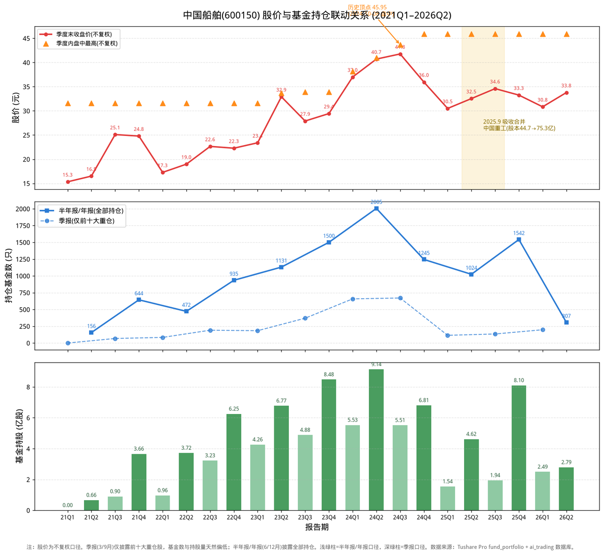

# 中国船舶：六年基金持仓与股价的“背离密码”

股价从13元涨到45.95元的历史顶点，基金持仓从0只冲到2005只，再砍到135只——中国船舶过去六年的基金持仓曲线，画出了一条比股价更惊心动魄的轨迹。2024年二季度基金蜂拥重仓时，正是股价冲顶45.95元的前夜；2026年基金大撤退后，股价反而企稳在34元。基金到底是在追涨，还是在抢跑？

我是浩哥，**致力于用AI拓宽投资认知边界**。🤖

不荐股，只拆解逻辑。我将高校财务教授的战略分析法蒸馏进DeepSeek模型，形成六维画像，以此审视企业整体财务质量。

拒绝一叶障目，力求解码全局。

P.S. 本文由AI生成，**仅作学术交流与逻辑探讨，不构成买卖依据**，投资请自行判断。欢迎球友们交流指正。

---

## 一、先看一张图：股价与基金持仓的六年全景

上图三张子图，自上而下是：**季度末收盘价与季度内盘中高点、持仓基金家数、基金持股总量**（2021Q1 至 2026Q2，共22个报告期）。数据来自 Tushare Pro `fund_portfolio` 接口（已按联合主键去重），股价为**不复权**口径，取各季度末最近交易日收盘价，并用橙色三角标注各季度内盘中最高价。

**先交代一个关键口径**：基金持仓披露有“大小年”——

- **季报（3月、9月）**：基金只披露**前十大重仓股**；
- **半年报（6月）、年报（12月）**：披露**全部股票持仓**。

所以基金家数和持股量会在季报季度“塌下去”、在半年报/年报季度“鼓起来”。看这张图时，要**只看同色系（同口径）之间的比较**，别拿季报的135只去比年报的1542只。

## 二、六年四个阶段：基金如何“追”中国船舶

| 阶段 | 时间 | 股价区间(不复权) | 基金动作 | 特征 |
|---|---|---|---|---|
| 冷启动 | 2021H1–2021Q3 | 15→25元 | 从0只到68只 | 无人问津→初步建仓 |
| 第一轮抱团 | 2021Q4–2023Q4 | 22→29元 | 644只→1500只 | 造船周期启动，主动基金扎堆 |
| 顶点狂欢 | 2024Q1–2024Q3 | 37→45.95元 | **2005只创纪录** | 股价与持仓同步见顶 |
| 大撤退+修复 | 2025–2026 | 27→34元 | 砍到115只，再回补 | 合并中国重工，筹码大换手 |

### 阶段一：2021年，从“无人问津”到“小荷初露”

2021年一季报（20210331），全市场7009只披露持仓的基金里，**没有一只**持有中国船舶。到2021年二季报，156只基金开始建仓，持股0.66亿股；三季报（仅前十大口径）有68只基金把它买进前十大。

此时股价从15.33元（21Q1末）涨到25.10元（21Q3末），一年间最大涨幅近一倍（2021年盘中最高30.99元）。**基金是从“完全没配置”起步的**——2021年中国船舶在基金眼里还是个“冷门股”。

### 阶段二：2022–2023年，造船周期启动，主动基金扎堆

这是中国船舶基金持仓的“主升浪”：

- 2021年报：644只基金，持股3.66亿股，市值91亿；
- 2022年报：935只基金，持股6.25亿股，市值139亿；
- 2023年报：**1500只基金，持股8.48亿股，市值250亿**，其中主动基金1182只。

三年间基金家数翻倍、持股量翻倍多。此时股价却从25元回落到22元（22Q4）再回升到29元（23Q4）——**基金在股价横盘期持续加仓**，这是典型的“造船周期左侧布局”：2021年起高价船订单放量，基金押注未来2-3年的业绩兑现。

### 阶段三：2024年，顶点狂欢——2005只基金抱团，股价冲上45.95元

2024年二季报，中国船舶基金持仓达到**历史极值**：

- 持仓基金**2005只**（其中主动1641只）；
- 持股**9.14亿股**，市值**372亿**；
- 占当时总股本（44.72亿股）约**20%**。

而股价也在2024年10月8日摸到**不复权历史顶点45.95元**（盘中）。此后一路阴跌，再也没有回到这个高度。

基金在2024年上半年把中国船舶买到极致，恰好“买在最高点”。这个教训值得记一辈子：**当一只股票的基金持仓达到历史极值时，往往意味着边际买盘已经枯竭。**

### 阶段四：2025–2026年，大撤退与筹码大换手

2025年，中国船舶迎来两个巨变：

1. **主动基金夺路而逃**：2025年一季报（前十大口径）主动基金只剩82只，持股从2024Q2的9.14亿股砍到0.78亿股，**三个月砍掉91%**。
2. **9月吸收合并中国重工**：总股本从44.72亿股暴增至75.26亿股，中国船舶调入沪深300、上证50等主流指数，**被动指数基金被迫大举买入**——2025年报被动基金710只、持股6.14亿股，创被动持仓新高。

于是出现了“基金总数创历史新高（1542只），但主动基金早已跑路”的背离现象。**看基金持仓，不能只看总数，必须拆主动/被动。**

2026年，主动基金重新回补：一季报主动138只（较25Q3的81只翻倍）、持股1.15亿股；半年报继续增至225只、1.36亿股。但占股本仅1.8%，距离2024年巅峰的20%相去甚远。

## 三、三组“背离”读懂基金行为

把股价和持仓放到一起，能看出三组耐人寻味的背离：

**背离一：2024年“基金高点=股价顶点”。** 基金持仓2024Q2见顶（2005只/9.14亿股），股价2024年10月见顶（盘中45.95元）。基金买在最高点，随后2025年主动基金砍掉九成。**基金抱团的极值，是反向指标。**

**背离二：2022–2023年“股价横盘、基金加仓”。** 股价在22–29元震荡两年，基金却从644只加到1500只。这是左侧布局——基金在等造船周期业绩兑现，而不是追股价。

**背离三：2025–2026年“基金总数新高，主动基金新低”。** 2025年报1542只基金看似热闹，主动基金其实已从峰值撤离；被动指数基金因纳入沪深300“不得不买”。**真正的聪明钱（主动基金）早已用脚投票，接盘的是指数基金。**

## 四、2026年：主动基金回来了，但“买法”变了

2026年主动基金重新加仓，但加仓主体和逻辑与2024年完全不同：

| 维度 | 2024年（顶点） | 2026年（回补） |
|---|---|---|
| 主动基金持股 | 9.14亿股（24Q2） | 1.36亿股（26Q2） |
| 占股本 | ~20% | 1.8% |
| 加仓主力 | 主动权益抱团 | 军工主题+固收增强+量化 |
| 基金心态 | 追涨右侧 | 低位修复 |

2026年加仓最坚决的是**军工主题基金**：南方军工改革（823万股）、华夏臻选回报（295万股）、前海开源中航军工（237万股）；新进的有华夏回报（536万股）、长信国防军工量化（298万股）等。

支撑逻辑也变了：合并中国重工后，“南北船”造船资产整体上市，2025年营收1520亿（+93%）、归母净利78.5亿（+117%），高价船订单进入交付高峰，业绩确定性增强。**这次的加仓，更多是对基本面兑现的确认，而非2024年那种情绪驱动。**

## 五、结论

**从2021年到2026年，基金对中国船舶经历了一轮完整的“冷启动→抱团→见顶→大撤退→修复回补”周期。**

- 2021年：无人问津（0只起步）
- 2022–2023年：造船周期左侧布局，主动基金持续加仓
- 2024年：抱团到极致（2005只），股价冲顶45.95元（不复权盘中历史最高）
- 2025年：主动基金砍掉九成，被动基金因合并纳入指数被迫接盘
- 2026年：主动基金低位回补，但占比远未回到巅峰

**一句话总结**：2026年基金对中国船舶是**加仓**，且以主动基金回补为主导；但这是“低位修复”而非“新一轮抱团”。对投资者而言，最值得警惕的信号恰恰是——**当基金持仓下一次再逼近历史极值时，或许又到了该冷静的时候。**

---

## 风险提示

1. **口径风险**：季报仅披露前十大重仓，本文季报口径数据天然偏低，请区分大小年再比较。
2. **股本摊薄**：2025年9月吸收合并后总股本扩大68%，前后持股量不可直接对比，本文已按口径标注。
3. **数据时效**：2026年半年报截至8月中旬披露约60%，基金家数可能继续增加，文中已注明。
4. **股价口径**：本文股价均为不复权口径，历史顶点为2024-10-08盘中45.95元。
5. **基金持仓为滞后披露**：报告期数据通常滞后1-2个月公布，仅反映历史时点，不代表当前实时持仓。

---

**💬互动征集：想看哪家公司的 AI 蒸馏专家分析？**
评论区留下公司名称 / 股票代码，浩哥每周精选 2-3 家，下期发布分析。

---

ai_trading 开源 AI 财报分析系统，**两分钟**生成行业/个股深度分析，**查看** GitHub/Gitee：zhitucoder/ai-trading。

**免责声明：**内容由 zhitucoder/ai-trading 系统AI生成，AI 存在模型幻觉，**仅供学习参考，不构成投资建议**。
