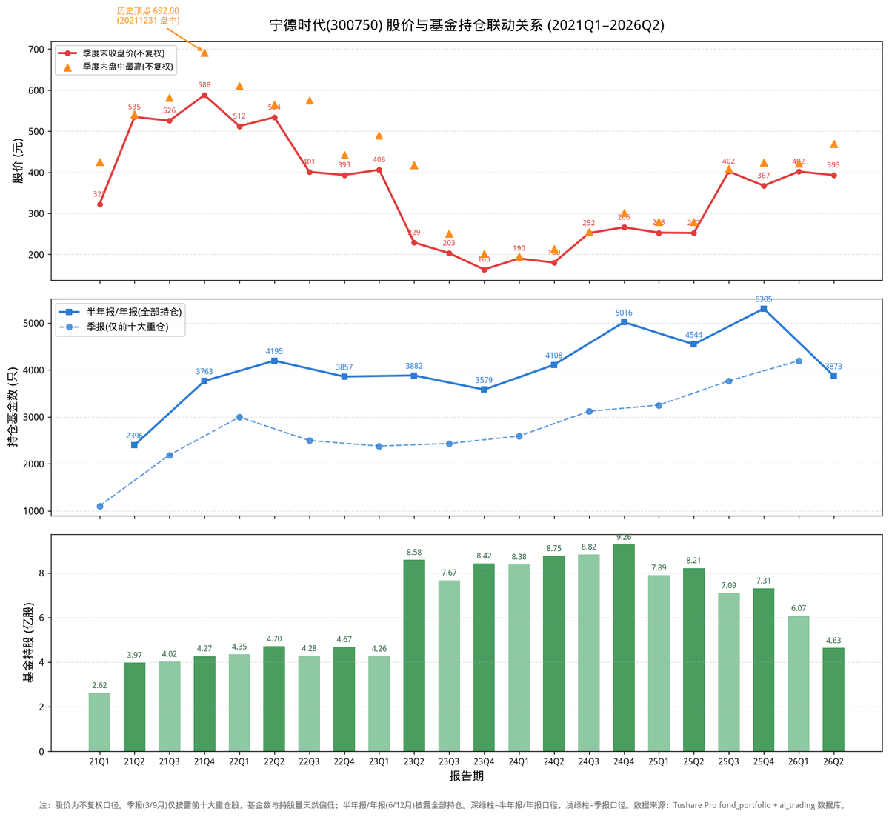

# 宁德时代：基金抱团“宁王”，从692元跌到146元为何死扛不卖？

股价从692元跌到146元，基金却从3763只不减反增——宁德时代过去六年，基金走出了一条与“追涨杀跌”完全相反的路：股价崩盘79%，基金硬扛四年，最终等来了业绩反转。这只曾经的“宁王”，是公募基金“信仰投资”最极致的样本：买的时候疯狂，套的时候死扛，回本的时候才开始撤退。

我是浩哥，**致力于用AI拓宽投资认知边界**。🤖

不荐股，只拆解逻辑。我将高校财务教授的战略分析法蒸馏进DeepSeek模型，形成六维画像，以此审视企业整体财务质量。

拒绝一叶障目，力求解码全局。

P.S. 本文由AI生成，**仅作学术交流与逻辑探讨，不构成买卖依据**，投资请自行判断。欢迎球友们交流指正。

---

## 一、先看一张图：六年股价与基金持仓全景

上图三张子图，自上而下是：**季度末收盘价与季度内盘中高点、持仓基金家数、基金持股总量**（2021Q1 至 2026Q2，共22个报告期）。数据来自 Tushare Pro `fund_portfolio` 接口（联合主键去重），股价为**不复权**口径。

**三个关键口径，先说清楚：**

1. **季报（3/9月）只披露前十大重仓**，半年报（6月）、年报（12月）披露全部持仓，基金家数因此“大小年”交替。
2. **2023年4月“10转8”送转**：股本从约26亿股扩张到46亿股，持股量数据在2023Q2出现翻倍跳升，这是除权假象，不是基金真实增持。
3. **2026年半年报披露不完全**：截至8月中旬约60%基金已披露，2026Q2的基金家数（3873只）和持股量（4.63亿股）偏低，实际应更高。

## 二、六年三个阶段：基金如何“陪”宁德时代过山车

| 阶段 | 时间 | 股价区间(不复权) | 基金动作 | 特征 |
|---|---|---|---|---|
| 宁王神话 | 2021 | 280–692元 | 1102→3763只 | 抱团顶点，买在最高 |
| 深套死扛 | 2022–2024H1 | 140–610元 | 3857→5016只 | 股价跌79%，基金不减反增 |
| 反转+撤退 | 2024H2–2026 | 209–469元 | 5305只峰值→回落 | 回本后开始撤退 |

### 阶段一：2021年，“宁王”神话与692元顶点

2021年是宁德时代的巅峰之年。全球动力电池龙头，市占率第一，被市场捧为“宁王”。股价从280元一路涨到**不复权历史顶点692元**（2021年12月盘中）。

基金也在这一年疯狂涌入：

- 2021年一季报：1102只基金，持股2.62亿股；
- 2021年四季度：**3763只基金，持股4.27亿股，市值2509亿**。

一年之内基金家数翻了3.4倍，把宁德时代买成了公募第一重仓股。**这是“宁王”信仰的顶点，也是此后四年深套的起点。**

### 阶段二：2022–2024年，股价跌79%，基金“死扛”不卖

2022年起，锂电池行业急转直下：产能过剩、碳酸锂价格暴跌、价格战全面爆发。宁德时代股价从692元一路跌到**2024年最低140元，跌幅近80%**。

但最反直觉的一幕出现了：**基金不仅没有夺路而逃，反而越跌越买。**

- 2022年半年报：基金4195只，持股4.70亿股；
- 2023年（10转8后）：基金维持在3579–3882只，持股8.42–8.58亿股；
- 2024年半年报：基金**4108只**，持股8.75亿股——比2021年顶点时还多！

把2023年“10转8”的股本扩张还原（转增前持股×1.8），基金实际持股量在2022–2024年稳定在**8亿股左右**，从未大幅减持。

**为什么死扛？** 因为宁德时代是公募基金的“压舱石”——新能源赛道不可丢弃、龙头地位无人撼动、长线逻辑仍在。基金宁可在浮亏中硬扛四年，也不愿承认“宁王”信仰的破灭。这是“信仰投资”最极致的写照。

### 阶段三：2024H2–2026年，业绩反转，基金回本后撤退

2024年下半年起，行业出清见效，碳酸锂价格企稳，宁德时代业绩反转：

| 指标 | 2022 | 2023 | 2024 | 2025 |
|---|---|---|---|---|
| 营收 | 3286亿(+152%) | 4009亿(+22%) | 3620亿(-9.7%) | **4237亿(+17%)** |
| 净利 | 307亿(+93%) | 441亿(+44%) | 507亿(+15%) | **722亿(+42%)** |
| ROE | 17.4% | 20.1% | 18.6% | **19.5%** |

股价从140元回升到424元（2025年盘中），基金数在2025年四季度达到**5305只**的历史峰值——注意，这比2021年抱团顶点的3763只还多。

**但到了2026年，基金开始撤退：**

- 2026年二季度：基金3873只（披露不全），持股4.63亿股，市值1817亿；
- 主动基金明显减仓：华夏能源革新股票（-107万股）、广发多因子混合（-94万股）、东方新能源汽车主题（-59万股）等。

**回本了，信仰也兑现了，基金开始用脚投票。** 这印证了一个朴素规律：基金在深套时死扛，恰恰在回本/获利时撤退——“解套盘”的压力，往往比“套牢盘”更大。

## 三、2026年二季度：谁在减仓，谁在加仓？

减仓最坚决的主动基金：

| 基金 | 二季度减仓 | 剩余持仓 |
|---|---|---|
| 华夏能源革新股票A/C | -107万股 | 113万股 |
| 广发多因子灵活配置 | -94万股 | 169万股 |
| 东方新能源汽车主题 | -59万股 | 99万股 |
| 睿远均衡价值三年持有A/C | -53万股 | 172万股 |
| 中欧双利债券A/C | -53万股 | 3万股 |

仍在加仓的主动基金：

| 基金 | 二季度加仓 | 现持有 |
|---|---|---|
| 华富新能源股票A/C | +48万股 | 158万股 |
| 汇添富价值精选混合A/O | +48万股 | 178万股 |
| 华宝核心优势混合A/C | +44万股 | 65万股 |
| 摩根新兴动力混合A/C | +31万股 | 253万股 |

减仓与加仓并存，说明基金内部对宁德时代的分歧正在加大——**不再是2021年那种“一致性看多”，而是进入了“信仰分化”的阶段。**

## 四、结论

**从2021年到2026年，基金对宁德时代走出了一条“抱团→死扛→回本撤退”的完整周期。**

- 2021年：3763只基金抱团“宁王”，买在692元顶点；
- 2022–2024年：股价跌79%，基金硬扛四年不减仓（持股稳定8亿股）；
- 2024H2–2025年：业绩反转，基金数冲上5305只历史峰值；
- 2026年：基金开始撤退，持股从峰值9.26亿股降至4.63亿股（披露不全口径）。

**一句话总结**：2026年基金对宁德时代是**减仓**，但这是一场“迟到了四年的撤退”——基金在2021年买在最高点，在2022-2024年深套中死扛，最终在2025-2026年回本后开始离场。宁德时代的基金持仓史，就是一部“信仰如何被套牢、又如何被兑现”的教科书。

对投资者而言，最值得记住的教训是：**基金越跌越买不一定是“抄底”，可能只是“死扛”；而基金开始撤退时，才是信仰真正动摇的时刻。**

---

## 风险提示

1. **口径风险**：季报仅披露前十大重仓，基金数天然偏低，请区分口径比较。
2. **送转除权**：2023年4月“10转8”，前后持股量不可直接对比，本文已按口径说明。
3. **数据时效**：2026年半年报截至8月中旬披露约60%，基金家数与持股量偏低，实际可能更高。
4. **股价口径**：本文股价为不复权，历史顶点2021-12盘中692元；2024年最低140元。
5. **基金持仓为滞后披露**：报告期数据滞后1-2个月公布，仅反映历史时点。

---

**💬互动征集：想看哪家公司的 AI 蒸馏专家分析？**
评论区留下公司名称 / 股票代码，浩哥每周精选 2-3 家，下期发布分析。

---

ai_trading 开源 AI 财报分析系统，**两分钟**生成行业/个股深度分析，**查看** GitHub/Gitee：zhitucoder/ai-trading。

**免责声明：**内容由 zhitucoder/ai-trading 系统AI生成，AI 存在模型幻觉，**仅供学习参考，不构成投资建议**。
