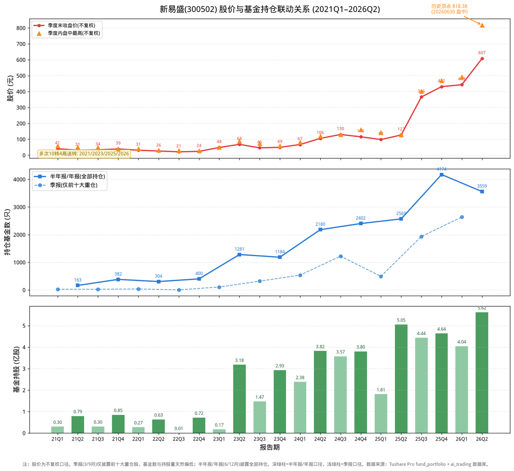

# 新易盛：基金抱团买在800元顶，回撤45%后谁在站岗？

股价从20元涨到818元，基金持仓从4只冲到3559只——新易盛是过去六年A股最疯狂的“基金抱团”样本。2026年二季度，3559只基金、5.62亿股、3413亿元市值，全部创下历史新高。而就在基金买得最凶的时候，股价已经摸到818元的历史顶点，两个月内回撤45%。基金到底是在分享AI红利，还是在山顶接盘？

我是浩哥，**致力于用AI拓宽投资认知边界**。🤖

不荐股，只拆解逻辑。我将高校财务教授的战略分析法蒸馏进DeepSeek模型，形成六维画像，以此审视企业整体财务质量。

拒绝一叶障目，力求解码全局。

P.S. 本文由AI生成，**仅作学术交流与逻辑探讨，不构成买卖依据**，投资请自行判断。欢迎球友们交流指正。

---

## 一、先看一张图：六年股价与基金持仓全景

上图三张子图，自上而下是：**季度末收盘价与季度内盘中高点、持仓基金家数、基金持股总量**（2021Q1 至 2026Q2，共22个报告期）。数据来自 Tushare Pro `fund_portfolio` 接口（联合主键去重），股价为**不复权**口径。

**两个关键口径先说明：**

1. **季报（3/9月）只披露前十大重仓**，半年报（6月）、年报（12月）披露全部持仓。所以基金家数在季报季度“塌下去”、半年报/年报季度“鼓起来”——看图时要同口径对比。
2. **新易盛频繁高送转**（2021/2023/2025/2026四次“10转4”），不复权价格在除权日会跳空。图中股价看似“无缺口”，是因为它除权后迅速填权、继续大涨——这本身就是强势股的标志。

## 二、六年四阶段：基金如何“追”新易盛

| 阶段 | 时间 | 股价区间(不复权) | 基金动作 | 驱动 |
|---|---|---|---|---|
| 冷启动 | 2021–2022 | 20–59元 | 4只→400只 | 光模块周期底部，无人问津 |
| AI爆发 | 2023 | 23–88元 | 106只→1184只 | ChatGPT点燃AI算力，800G光模块起量 |
| 主升浪 | 2024–2025 | 41–469元 | 537只→4174只 | 1.6T光模块放量，业绩爆发 |
| 冲顶+回撤 | 2026 | 346–818元 | **3559只创纪录** | 基金高位抱团，股价冲顶后回撤45% |

### 阶段一：2021–2022年，光模块底部的“冷门股”

2021年一季报，全市场只有**26只基金**持有新易盛，持股0.30亿股。到2022年三季报，只剩**4只**基金——这是六年来的绝对冰点。

彼时新易盛股价在20–40元区间徘徊，2022年营收33亿、净利9亿，光模块行业正处周期底部。**基金把它当“冷门小票”，几乎无人问津。**

### 阶段二：2023年，ChatGPT点燃AI算力

2023年二季报是分水岭：基金数从106只暴增到**1281只**，持股从0.17亿股跳到**3.18亿股**，一个季度翻了近20倍。

驱动力是ChatGPT横空出世，AI算力需求爆发，800G光模块进入放量周期。新易盛作为光模块龙头，股价从23元（23Q1）涨到88元（23Q3盘中）。**这是基金第一次“抢筹”式建仓，买在AI浪潮的起点。**

### 阶段三：2024–2025年，业绩兑现，基金主升浪

这是“业绩与持仓双击”的黄金期：

- 2024年报：**537只基金 → 2402只**，持股3.80亿股；营收86.5亿（+179%）、净利28.4亿（+312%）；
- 2025年报：**基金4174只**，持股4.64亿股；营收248.4亿（+187%）、净利95.3亿（+236%）、ROE高达**52.77%**。

股价从41元（24Q1）一路涨到469元（25Q4），三年涨了十倍。**这一阶段基金是“真金白银的加仓”，逻辑也最扎实——业绩在持续兑现，而非单纯炒概念。**

### 阶段四：2026年，冲顶818元，基金买在最高点

2026年二季报，基金持仓达到**历史极值**：

- 持仓基金**3559只**（主动2532只）；
- 持股**5.62亿股**，市值**3413亿元**；
- 前十大重仓基金里，国泰中证全指通信设备ETF持仓市值高达92亿元。

而股价在2026年6月5日摸到**不复权历史顶点818.38元**（盘中）。此后两个月，股价一路回撤到448元，**回撤幅度45.2%**。

**关键背离出现了：基金持仓6月30日报告期仍处历史高位，而股价已从顶点跌去近一半。** 这正是本文最想揭示的信号——**基金又一次“买在最高点”。**

## 三、与中国船舶对比：同样的“抱团顶”剧本

把新易盛与中国船舶（上一篇文章分析）放到一起，会发现一个惊人的相似：

| 特征 | 中国船舶(2024) | 新易盛(2026) |
|---|---|---|
| 基金持仓极值 | 2005只（24Q2） | 3559只（26Q2） |
| 股价顶点 | 45.95元（24-10） | 818.38元（26-06） |
| 顶点后回撤 | 主动基金砍掉91% | 股价回撤45%（进行中） |
| 共同点 | **基金抱团极值=股价顶** | **基金抱团极值=股价顶** |

两家公司、两个行业、两个年份，却走出了同一条路径：**基金持仓达到历史极值时，股价往往已经见顶。** 这不是巧合，而是资金规律的体现——当边际买盘（基金）已经全部进场，剩下的只有卖出。

## 四、谁在2026年二季度冲进去“站岗”？

2026年二季度，加仓最猛的主动基金：

| 基金 | 二季度加仓 | 现持有 |
|---|---|---|
| 大成科技创新混合A/C | +305万股 | 391万股 |
| 财通成长优选混合A/C | +251万股 | 325万股 |
| 信澳业绩驱动混合A/C | +233万股 | 311万股 |
| 富国创新科技混合A/C | +205万股 | 370万股 |
| 平安科技精选混合A/C | +178万股 | 188万股 |

新进重仓的还有：广发远见智选混合（204万股）、易方达科翔混合（83万股）等。

这些基金在二季度（4–6月）集中加仓，而股价正是在6月初见顶。**以大成科技创新为例，二季度加仓305万股，按二季度均价估算成本约500–700元，当前股价448元，浮亏明显。**

## 五、结论：2026年基金在加仓，但加在了山顶

**从2021年到2026年，基金对新易盛经历了一轮完整的“冷门→抢筹→主升→山顶抱团”周期。**

- 2021–2022年：光模块底部，无人问津（4只起步）
- 2023年：AI算力爆发，基金抢筹（106→1281只）
- 2024–2025年：业绩兑现，基金主升浪（537→4174只），逻辑最扎实
- 2026年：基金高位抱团（3559只创纪录），股价冲顶818元后回撤45%

**一句话总结**：2026年基金对新易盛是**加仓**，且加在了历史最高点。这与2024年的中国船舶如出一辙——**当基金持仓达到历史极值，往往是股价见顶的领先信号。**

新易盛的基本面远好于当年的中国船舶（ROE 52.77%、净利连续三年三位数增长），所以回撤后的修复能力也更强。但对投资者而言，最该警惕的依然是那句老话：**在基金抱团最拥挤的时候追进去，往往就是最后的接盘者。**

---

## 风险提示

1. **口径风险**：季报仅披露前十大重仓，基金数天然偏低；请区分口径比较。
2. **高送转摊薄**：新易盛多次“10转4”，不复权价格在除权日跳空，跨年度股价不可直接对比。
3. **数据时效**：2026年半年报截至8月中旬披露约60%，基金家数可能继续增加。
4. **股价口径**：本文股价为不复权，历史顶点2026-06-05盘中818.38元；最新价已回撤至448元（回撤45.2%）。
5. **基金持仓为滞后披露**：报告期数据滞后1-2个月公布，6月30日持仓反映的是回撤前的高位，不代表当前实时持仓。

---

**💬互动征集：想看哪家公司的 AI 蒸馏专家分析？**
评论区留下公司名称 / 股票代码，浩哥每周精选 2-3 家，下期发布分析。

---

ai_trading 开源 AI 财报分析系统，**两分钟**生成行业/个股深度分析，**查看** GitHub/Gitee：zhitucoder/ai-trading。

**免责声明：**内容由 zhitucoder/ai-trading 系统AI生成，AI 存在模型幻觉，**仅供学习参考，不构成投资建议**。
