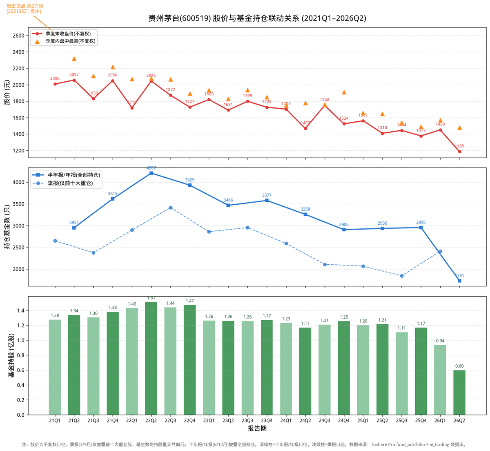

# 贵州茅台：基金抱团六年，从4207只撤退到1731只

股价从2627元跌到1185元，基金持仓从4207只撤退到1731只——贵州茅台过去六年，走出了一条与“基金抱团”反向的路：基金不是在追涨，而是在持续撤退。更耐人寻味的是，社保基金早在2016年就开始减持，2018年底就退出了前十大流通股东。当公募基金还在为茅台站台时，社保基金已经悄悄离场了。

我是浩哥，**致力于用AI拓宽投资认知边界**。🤖

不荐股，只拆解逻辑。我将高校财务教授的战略分析法蒸馏进DeepSeek模型，形成六维画像，以此审视企业整体财务质量。

拒绝一叶障目，力求解码全局。

P.S. 本文由AI生成，**仅作学术交流与逻辑探讨，不构成买卖依据**，投资请自行判断。欢迎球友们交流指正。

---

## 一、先看一张图：六年股价与基金持仓全景

上图三张子图，自上而下是：**季度末收盘价与季度内盘中高点、持仓基金家数、基金持股总量**（2021Q1 至 2026Q2，共22个报告期）。数据来自 Tushare Pro `fund_portfolio` 接口（联合主键去重），股价为**不复权**口径。

**两个口径说明：**

1. **季报（3/9月）只披露前十大重仓**，半年报（6月）、年报（12月）披露全部持仓，所以基金家数在季报季度偏低、半年报/年报季度偏高。
2. **茅台每年高额分红**（10派200-300元），不复权价格在除息日会跳空，图中股价看似有“台阶”，正是分红除息所致。茅台从未送转股，总股本稳定在12.5亿股。

## 二、六年主基调：基金持续撤退，与股价同步下行

| 阶段 | 时间 | 股价区间(不复权) | 基金动作 | 背景 |
|---|---|---|---|---|
| 高位抱团 | 2021–2022 | 1333–2628元 | 4207只创纪录 | 核心资产信仰顶点 |
| 缓慢松动 | 2023–2024 | 1245–1935元 | 4207→2906只 | 消费降级、库存周期 |
| 加速撤离 | 2025–2026 | 1151–1658元 | 2906→1731只 | 营收首现负增长 |

### 阶段一：2021–2022年，4207只基金抱团的“信仰顶点”

2021年初，贵州茅台股价摸到**不复权历史顶点2627.88元**（2021年2月盘中），此时正是公募基金“核心资产信仰”的巅峰。

- 2021年报：3615只基金，持股1.38亿股，市值2834亿；
- 2022年半年报：**4207只基金**，持股1.51亿股，市值3094亿——这是六年基金家数的绝对峰值。

但注意：基金家数在2022年二季度见顶时，股价已经从2627元跌到2045元。**基金并没有在股价顶点撤退，而是在下跌途中“越跌越买”——这恰恰是抱团信仰最危险的时候。**

### 阶段二：2023–2024年，信仰松动，基金缓慢撤退

2023年起，茅台基本面出现隐忧：消费降级、渠道库存高企、批价松动。基金开始松动：

- 2023年报：3577只，持股1.27亿股；
- 2024年报：2906只，持股1.25亿股。

基金家数从4207只缓慢降到2906只，但持股量始终维持在1.2-1.5亿股的区间——**减持是“钝刀子割肉”，而非断崖式出逃。**

### 阶段三：2025–2026年，营收负增长，基金加速撤离

2025年是转折点：茅台上市以来罕见的**营收负增长**——

| 指标 | 2022 | 2023 | 2024 | 2025 |
|---|---|---|---|---|
| 营收 | 1241亿(+16.9%) | 1477亿(+19.0%) | 1709亿(+15.7%) | **1688亿(-1.2%)** |
| 净利 | 627亿(+19.6%) | 747亿(+19.2%) | 862亿(+15.4%) | **823亿(-4.5%)** |

营收、净利**双双首次负增长**，基金加速撤离：

- 2026年一季报：2410只，持股0.94亿股；
- 2026年半年报：**1731只，持股0.60亿股，市值708亿**——创六年新低。

从2022年二季度峰值（4207只/1.51亿股）到2026年二季度（1731只/0.60亿股），**基金家数减少59%，持股量减少60%，持仓市值从3094亿缩水到708亿。**

## 三、社保基金：早在2016年就“先知先觉”地撤退了

这是本文最想揭示的一条线索。查询贵州茅台前十大流通股东历史数据，**全国社保基金一零一组合**的持仓变化如下：

| 报告期 | 社保一零一组合持股 | 占流通股 | 动作 |
|---|---|---|---|
| 2015Q2 | 497.8万股 | 0.44% | 建仓期 |
| 2015Q4 | **574.6万股** | 0.46% | **历史峰值** |
| 2016Q2 | 538.4万股 | 0.43% | 开始减持 |
| 2016Q3 | 512.0万股 | 0.41% | 继续减持 |
| 2017Q2 | 471.8万股 | 0.38% | 减40万股 |
| 2018Q3 | 263.0万股 | 0.21% | 减半 |
| 2018Q4之后 | **退出前十大** | — | 彻底离场 |

**社保基金的时间线值得玩味：**

1. 社保基金在**2015-2016年**就达到了茅台持仓的峰值（574.6万股），此时茅台股价还在200-300元（不复权）；
2. 从**2016年二季度**开始，社保基金连续减持，一路减到2018年三季度的263万股；
3. **2018年底，社保基金彻底退出茅台前十大流通股东**，此后至今（2016-2026）从未再进入前十大。

而公募基金呢？恰恰在社保基金撤退之后，掀起了2020-2021年的“茅指数”抱团狂潮，把茅台股价从几百元推到2627元的历史顶点。

**社保基金卖在了“半山腰”，公募基金买在了“山顶”。** 当然，社保基金是长期资金、纪律性配置，其减持更多是组合再平衡而非精准择时——但“长期资金在众人狂热前离场”这个信号本身，值得每一位投资者深思。

> 注：前十大流通股东披露有滞后性，且社保基金可能通过多个组合持有，本文仅以“一零一组合”进入前十大流通股东的期间为准。

## 四、2026年二季度：谁在加速卖出？

2026年二季度，主动基金减仓最坚决的：

| 基金 | 二季度减仓 | 剩余持仓 |
|---|---|---|
| 易方达蓝筹精选混合 | -86万股 | 97万股 |
| 易方达消费行业股票 | -7万股 | 80万股 |
| 易方达裕鑫债券A/C | -14万股 | 9万股 |
| 安信睿见优选混合A/C | -11万股 | 24万股 |
| 汇添富品牌驱动混合 | -6万股 | 2万股 |

退出的有：景顺长城景颐双利债券（35万股）、鹏华匠心精选混合（32万股）、易方达研究精选股票（27万股）、汇添富价值精选混合（26万股）等。

**值得注意的是“易方达系”**：易方达蓝筹精选、易方达消费行业、易方达研究精选——这些昔日“茅指数”的标志性产品，如今都在减持茅台。蓝筹精选的基金经理张坤，曾是茅台最坚定的持有者，如今持仓已从巅峰期大幅回落。

## 五、结论

**从2021年到2026年，贵州茅台走出了一条与基金抱团反向的路径：基金持续撤退。**

- 2021–2022年：4207只基金抱团“信仰顶点”，但股价已先见顶；
- 2023–2024年：消费降级+库存压力，基金缓慢减持；
- 2025–2026年：营收净利双双负增长，基金加速撤离至1731只、持股0.60亿股，创六年新低；
- 社保基金（一零一组合）早在2016年就减持、2018年底退出前十大流通股东，此后再未回归。

**一句话总结**：2026年基金对贵州茅台是**持续减仓**，且减仓在加速。而社保基金作为“长线聪明钱”，早在八年前就完成了撤退。当基本面拐点（营收负增长）与资金面拐点（基金加速撤离）同时出现时，茅台的“核心资产”叙事，正在经历最严峻的考验。

---

## 风险提示

1. **口径风险**：季报仅披露前十大重仓，基金数天然偏低；请区分口径比较。
2. **分红除息**：茅台每年10派200-300元，不复权价格在除息日跳空，跨期比较需注意。
3. **数据时效**：2026年半年报截至8月中旬披露约60%，基金家数可能继续变化。
4. **社保基金披露局限**：前十大流通股东披露滞后且不完整，社保基金可能通过多个组合持有，本文仅以进入前十大的记录为准。
5. **股价口径**：本文股价为不复权，历史顶点2021-02盘中2627.88元。

---

**💬互动征集：想看哪家公司的 AI 蒸馏专家分析？**
评论区留下公司名称 / 股票代码，浩哥每周精选 2-3 家，下期发布分析。

---

ai_trading 开源 AI 财报分析系统，**两分钟**生成行业/个股深度分析，**查看** GitHub/Gitee：zhitucoder/ai-trading。

**免责声明：**内容由 zhitucoder/ai-trading 系统AI生成，AI 存在模型幻觉，**仅供学习参考，不构成投资建议**。
