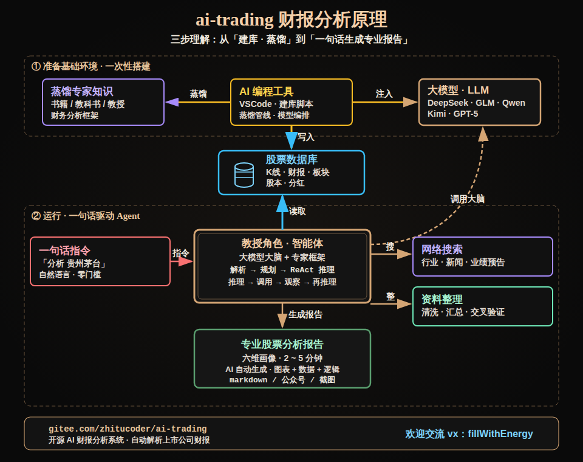

# ai-trading 财报分析原理

> 三步理解：从「建库 · 蒸馏」到「一句话生成专业报告」

## 流程图



## 核心逻辑

```
① 准备基础环境（一次性搭建）
   蒸馏专家知识 ←蒸馏— [AI编程工具·VSCode] —注入→ [大模型·LLM]
   书籍/教科书/教授                              DeepSeek·GLM·Qwen·Kimi·GPT-5
                              │ 写入（建库）
                              ↓
                        [股票数据库 · 圆柱体]
                         K线·财报·板块·股本·分红
                              ↑ 读取
                              │
② 运行·一句话驱动Agent
   [一句话指令「分析贵州茅台」] → [教授角色·智能体] —调用大脑→ [大模型·LLM]
                                       │  ReAct循环
                              ┌────────┴────────┐
                         [网络搜索]    [资料整理]
                         行业/新闻   清洗/汇总
                                       ↓
                        [专业股票分析报告·六维画像·2~5分钟]
```

## 2分钟读懂：AI Agent 是怎么做股票分析的？

传统方法：看财报 → 记指标 → 查资料 → 自己写分析，一只票要半天。

AI Agent 的解法，把这件事拆成了"**准备一次 + 以后每句话**"两步：

### ① 准备（一次性，花几天）

- 用 AI 编程工具（VSCode）把 **K线、财报、板块、股本** 全部建进数据库
- 把"财务教授怎么分析企业"的框架（**六维画像、核心利润、资产负债表重构**）蒸馏成 Agent 的"专家大脑"

### ② 运行（以后每句话，2-5分钟）

- 你说一句「**分析贵州茅台**」
- Agent 自动：**解析指令 → 规划分析路径 → 查数据库 → 搜网络资料 → 整理数据 → 生成报告**
- 关键在中间的 **ReAct 循环**（推理→调用→观察→再推理），像真人分析师一样：先想"该看什么"，再去查，看到结果再决定下一步

### 一句话总结

> AI Agent 做数据分析 = **把"专家的大脑"和"完整的数据"提前装好，之后你只需要一句话，它自己会查、会搜、会算、会写。**

## 项目与交流

- **项目地址**：`gitee.com/zhitucoder/ai-trading`
- **欢迎交流**：vx：fillWithEnergy

## 相关文件

- `AI_Agent_数据分析原理.png` — 成品图（960×760，深黑+香槟金）
- `AI_Agent_数据分析原理.svg` — SVG矢量源文件
- `AI_Agent_数据分析原理_生成脚本.py` — 生成脚本（改脚本重跑可重新生成）
