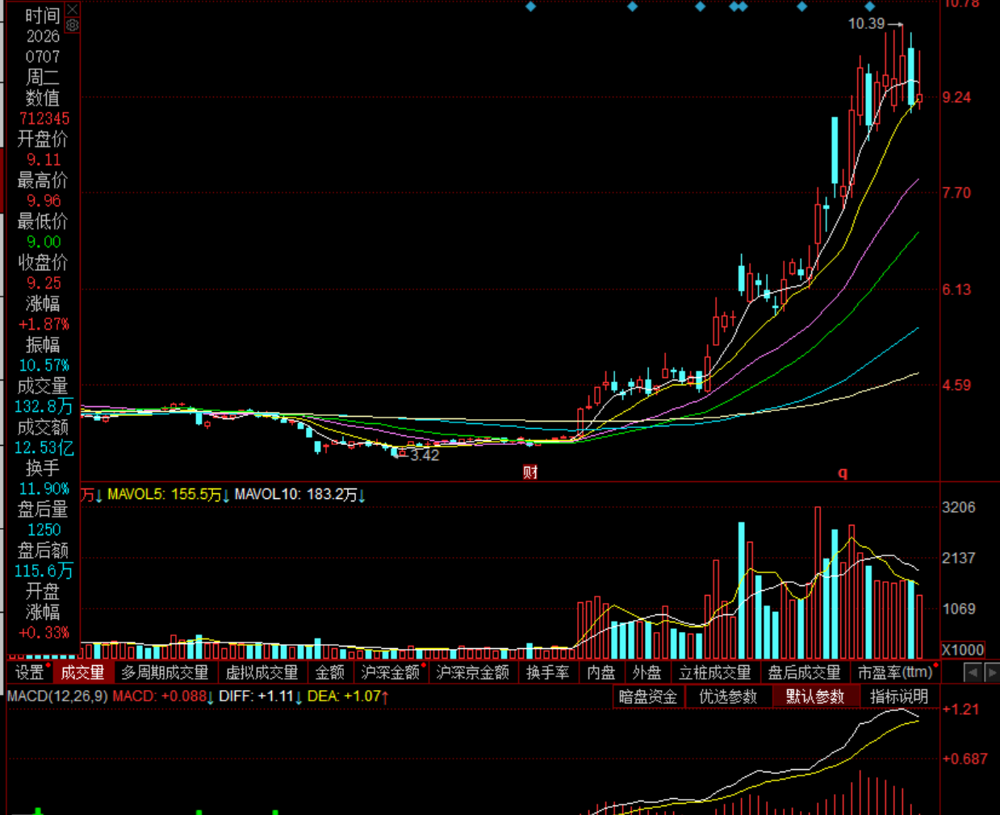
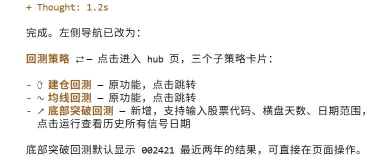

实战演示程序员日常工作

1. 需求。开发这个股票选股功能

2. 在选股策略（技术指标）页面，增加一个量化选股的功能，
根据如下量化规则，实现股票筛选功能 

量化规则
取今日往前 N 根 K 线（不含今日）；
对这 N 根 K 线，每一根都满足：
abs(当日涨跌幅) ≤ 4.0
等价：-4 ≤ (当日收盘价/前一日收盘价 - 1)*100 ≤ 4
附加辅助过滤（可选，减少假横盘）：
N 日内最高价、最低价区间波动幅度 ≤12%（箱体总振幅约束，避免宽幅震荡）
公式：(N日内最高 - N日内最低) / N日内最低 ≤ 0.12
条件 2：当日大阳线突破
今日单根 K 线满足：
当日涨跌幅 ≥ 7.0
等价：(今日收盘价 / 昨日收盘价 - 1) * 100 ≥ 7

# AI 对 程序员 

用户可以给你股票代码，你回测这个策略（底部突破回测）
，哪些日期触发这个信号，你出给触发信号的日期列表
系统左侧：添加一个回测策略导航： 里面有建仓回测、均线回测、和本策略的：底部突破回测

