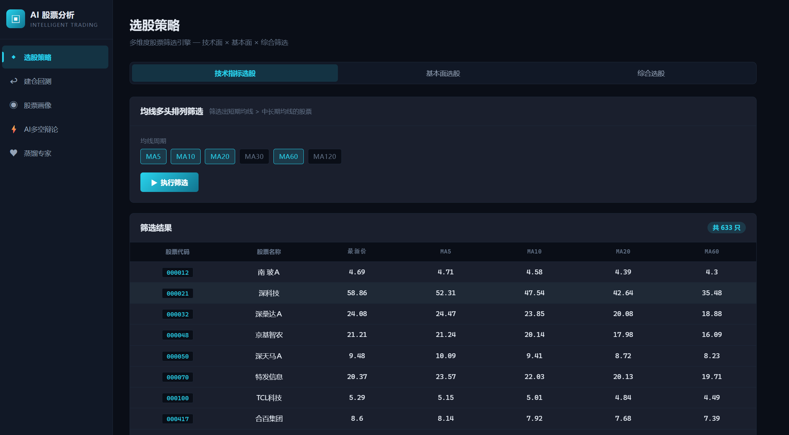
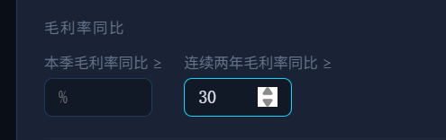
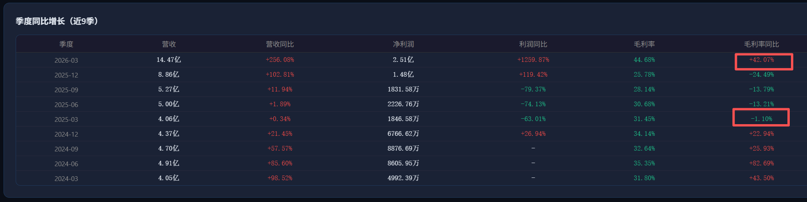

# 第12讲：基于财报数据-分析行业供需变化

> 目标：通过财务数据判断企业真实经营状况和供需格局变化
> 面向：已掌握基础量化分析的人员

---

## 背景与目标

财报分析的核心价值在于通过财务数据判断企业真实经营状况和供需格局变化。

同比增长率的意义在于观察企业过去几年盈利能力的变化趋势——毛利率、营收和净利润的连续增长表明企业在变强，反之则说明在变弱。

## 需求：财务比率统计与画像标签

实现一张统计表，计算各股票每季度/年度的财务比率，包括：毛利率增长率、营收增长率、归母净利润增长率。

基于该比率表，实现连续增长指标（按年度维度聚合）：

| 指标 | 维度 |
|------|------|
| 毛利率同比增长 | 连续 1/2/3/4 年 |
| 归母净利润同比增长 | 连续 1/2/3/4 年 |
| 营收同比增长 | 连续 1/2/3/4 年 |

## 股票画像集成

- 在股票画像中展示过去 4 年的毛利率趋势
- 将上述增长率指标作为企业基本面标签纳入画像数据
- 用户可根据这些增长率标签筛选股票，返回匹配的股票列表

# 补充

## 画像页面增加季度同比增长对比

当前已实现年度同比增长（基于12-31年报数据：毛利率、营收增长率、归母净利润增长率），在此基础上增加**季度同比增长**可视化：

| 功能 | 说明 |
|------|------|
| 维度 | 按季度聚合，每季度与上年同季度对比（YoY） |
| 时间跨度 | 过去5年（20个季度）的趋势变化 |
| 指标 | 毛利率同比、营收同比、归母净利润同比 |
| 数据源 | `fin_quarterly` 表（单季数据），`fin_income` 利润表自连接 |
| 展示方式 | 趋势折线图或柱状图，叠加在年度数据下方 |

季度同比增长能更早地捕捉到拐点信号——年度数据平滑了波动，可能掩盖近期的趋势反转。

## 毛利率筛选

### 1. 画像页面——近9季毛利率同比数据展示

在股票画像页面的「季度同比增长（近9季）」表格中，新增**毛利率同比增长率**一列。

计算方式：`(本季毛利率 - 上年同季毛利率) / 上年同季毛利率 * 100`

数据来源：`fin_quarterly` 表（单季数据），`fin_income` 利润表自连接，与上年同季自连接计算同比。

### 2. 画像页面—筛选功能——按毛利率同比筛选股票

在筛选器中增加毛利率同比相关条件，支持用户自定义阈值：

| 筛选条件 | 说明 | 默认值 | 用户可调 |
|----------|------|--------|----------|
| 本季度毛利率同比增长率 | 最新完整季度的毛利率同比增长需大于该值 | > 20% | ✅ |
| 连续N年毛利率同比增长率 | 最近N个完整财年（年报12-31），每年毛利率同比增长均需大于该值 | 连续2年 > 20% | ✅ N和阈值均可调 |

筛选逻辑：两个条件为 **AND** 关系——同时满足才入选。

股票画像筛选页面：
 连续N年毛利率同比增长率 计算错误，把这个功能改为本季度毛利率增长大于N，连续两年毛利率增长大于N 
 条件：

结果：

连续两年毛利率同比大于30%， 计算错误啊 股票：688766， 2026-03-31 毛利率增长率是+42.07%，2025-03-31 毛利率增长率是-1.1%，没有连续两年增长啊 

记录一下每次刷新股票画像的数据，需要多久 ， 刷新缓存按钮旁边，提示一下，平均耗时，上次耗时，告知用户等待多久才有最新数据