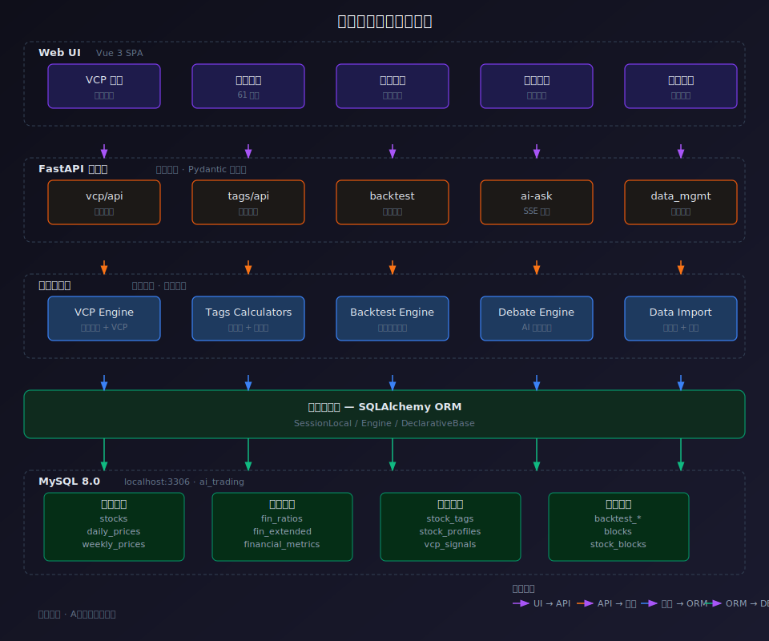

# 第1讲：AI编程范式 + 课程全景

> 目标：理解 AI 编程是什么、量化交易是什么，建立课程全景认知

> 面向：零编程基础人员

> ⚠️ 免责声明：本课程内容为教学演示，所有分析仅为技术面和基本面的客观数据呈现，不构成任何投资建议。投资有风险，入市需谨慎。

---


## 讲师介绍

**张思浩** — 10 年+程序员，架构师，西安交通大学研究生。

| 平台 | 链接 |
|------|------|
| 📺 B站 | [浩哥讲大模型与AI应用](https://space.bilibili.com/1235336642) |
| 📕 小红书 | **知途程序员**（zhituCodder — AI Native Coder，独立开发者） |
| 💬 CSDN | [星星之火](https://blog.csdn.net/spark_dev) |
| 📮 公众号 | 微信搜「知途程序员知识体系」或扫码关注 ↑ |


## 1.1 课程总览

**本课程的目标**：以 A 股量化系统为载体，让你掌握 AI 编程与蒸馏名人的方法论，成为驾驭 AI 的人。

**学完本课程的意义：**

掌握 AI 编程是进入 AI 时代的标志性能力。传统编程有很高的门槛（语法、框架、调试），AI 编程把门槛降到了自然语言——你从"写代码的人"变成"描述需求的人"。

这不是工具的升级，是角色的转变：
- **传统程序员 → AI 程序员** — 从手写每一行代码，变成把控方向、验证结果
- **普通人 → 产品开发人员** — 不需要编程基础，也能把自己的想法变成产品

本课程就是帮你完成这次角色转变——以量化系统为载体，用 12 讲让你具备 AI 编程的完整能力。


下面是整个系统的架构图，你可以直观地看到每一层（Web UI → FastAPI 应用层 → 业务逻辑层 → 数据访问层 → MySQL）和每个功能模块在架构中的位置：



**什么是 Vibe Coding（氛围编程）？**

2025 年 AI 领域最火的新范式——你不再"写"代码，而是"聊"出代码。

| 传统编程 | Vibe Coding |
|---------|------------|
| 学语法 → 查文档 → 敲代码 → 调试 | 用自然语言描述需求 → AI 生成代码 → 你验收 |
| 程序员的功夫在键盘上 | 你的功夫在表达上——描述清楚"要什么" |
| 改一个功能要改几十处 | 一句话，AI 自动调整 |
| 卡 bug 卡一晚上 | 把报错贴给 AI，它自己修 |

**Vibe Coding 这个词的来历：** 由 AI 初创公司 Mercury 联合创始人 Andrej Karpathy（前特斯拉 AI 总监、OpenAI 创始成员）在 2025 年初提出。核心思想是——**编程不再是"敲键盘"，而是"给氛围"**：你只要把意图、场景、约束描述清楚，剩下的交给 AI。

**Vibe Coding 的三个关键转变：**
1. **从"怎么实现"转向"要实现什么"** — 你不需要懂语法，只需要懂业务
2. **从"一次到位"转向"迭代逼近"** — 第一次结果不需要完美，逐步修改到满意
3. **从"亲手调试"转向"贴报错给 AI"** — AI 看自己的错误信息自修复

**本课程就是一门完整的 Vibe Coding 实践课** — 你不写一行 Python，只描述需求，Claude 帮你搭出一个完整的量化系统。

**学完你将掌握：**
- 用 Vibe Coding 方式给 Claude 下需求搭建完整系统
- 设计选股策略并回测验证
- 将任意人物蒸馏为 AI 角色辅助决策

**不需要你懂：**
- Python 语法、SQL 语句、服务器配置
- 你只需要会说话（描述需求），剩下的 Claude 帮你做

---

## 1.2 Claude 与 Vibe Coding —— 工具与选择

### AI 编程工具：把 Vibe Coding 从"聊天框"搬到"项目里"

1.1 讲的 Vibe Coding 是一种范式，要落地需要趁手的工具。光在网页对话框里聊出来的代码，你得自己复制到项目、自己运行、自己改……效率低还容易错。

**AI 编程工具解决的正是这件事**——它在终端里直接操作你的项目：读写文件、执行命令、操作 Git，你用自然语言说需求，它就在你的真实代码上干活。

本课程涉及两类工具，先讲清楚它们的关系和区别。

### Claude（模型）与 OpenCode / Claude Code（工具）的关系

很多人搞混这三者：

| 名称 | 是什么 | 角色 | 归属 |
|------|--------|------|------|
| **Claude** | 一个 AI 大模型（Anthropic 公司出品） | 背后干活的"大脑" | Anthropic |
| **Claude Code** | 官方 AI 编程 CLI 工具 | 把大脑接到你项目上的"官方管道" | Anthropic |
| **OpenCode** | 开源 AI 编程 CLI 工具 | 把大脑接到你项目上的"开源管道"，支持多种模型 | 社区 |

一句话：**大脑可选 Claude，管道可选 Claude Code 或 OpenCode。**

- 用 OpenCode 不等于不用 Claude ——OpenCode 可以连 Claude 模型，也能连 DeepSeek、GPT 等
- 用 Claude Code 也不等于只能用 Claude 模型 ——它也能接 DeepSeek

### Claude Code vs OpenCode + oh-my-opencode

本课程实测两款工具，都能完成全部任务，二选一即可：

| 对比项 | Claude Code | OpenCode + oh-my-opencode |
|-------|-------------|--------------------------|
| 出品方 | Anthropic 官方 | 社区开源 |
| 费用 | 按量计费（Token × 模型单价），用多少花多少 | 首月 $5，之后 $10/月包月（模型调用另算，很低） |
| 模型支持 | 以 Claude 系列为主，可接 DeepSeek | 多模型随意切换：Claude / DeepSeek / GPT 等 |
| 增强生态 | 自带 Skills 系统 | oh-my-opencode 提供 Skills 市场 + MCP + 多模型切换 |
| 权限控制 | 频繁弹窗申请权限（读/写/执行都要确认），打断思路 | 自动完成任务，无需反复确认，体验更流畅 |
| 新手友好 | 配置略多，权限确认多 | 包月无压力，技能生态更适合本课程 |


### 本课程的推荐选择

**我们主要用 OpenCode + oh-my-opencode 来实现本项目**，原因：

1. **费用可控** — 包月模式对新手无心理负担，不用盯着 Token 计费
2. **技能市场** — 第10讲"蒸馏专家"要用 oh-my-opencode 一键安装投资大师视角技能，OpenCode 工具链无缝衔接
3. **多模型切换** — 平时用 DeepSeek 省钱（国产、便宜、兼容 OpenAI 接口），需要高质量时切 Claude
4. **开源可定制** — 配置透明，社区活跃，长期可玩

> 💡 **已在用 Claude Code 的朋友**：本课程的所有指令和流程在两个工具上完全通用，你照常使用即可，差异只在第2讲的环境配置。

**不需要你纠结怎么选**，第2讲我们会手把手教你装好 OpenCode + oh-my-opencode。

---

## 1.3 AI 编程工作流

传统编程 vs AI 编程：

| 传统编程 | AI 编程 |
|---------|--------|
| 学语法 → 查文档 → 写代码 → 调试 | 描述需求 → AI 写代码 → 验证结果 |
| 遇到 bug 自己排查 | 告诉 AI 错误信息，AI 自修复 |
| 改功能要改多处代码 | 描述新需求，AI 自动调整 |

**工作流三步走：**

```
你说需求 → Claude 干活 → 你检查结果
   ↑                          |
   └──────── 不满意就提修改 ───┘
```

**核心心法：** 描述需求的能力比写代码更重要。你不需要知道「怎么实现」，只需要知道「要实现什么」。

---

## 1.4 量化交易全景

一个量化系统需要什么？

```
通达信数据 → MySQL 数据库 → 策略筛选 → 回测验证 → 分析参考
（原始）     （存储）      （选股）    （模拟）    （输出）
```

**五个环节，对应课程五步走：**
1. **采集数据** — 把通达信的 K 线和财报数据存到数据库
2. **存储管理** — 用 MySQL 管好这 9000 多支股票的数据
3. **策略筛选** — 告诉 Claude 你的选股条件，AI 帮你算
4. **回测验证** — 模拟过去几年的买卖，看策略能不能赚钱
5. **AI 决策辅助** — 让 AI 扮演投资大师，给你建议。更进一步，把交易大师（利弗莫尔、Minervini、巴菲特……）的思维方式**蒸馏**进 AI，让它用大师的视角分析你的股票——这就是本课程的「蒸馏专家」模块

---

## 1.5 项目路线图

这门课最终产物是什么？

**一个叫 "ai-trading" 的完整系统，包括：**

| 模块 | 功能 |
|------|------|
| **数据底盘** | 9288 支股票、1000 万+条日K线、8 张财务表 584 个字段、板块分类、股东增减持 |
| **数据管理后台** | 一键同步日K线 / 财务数据 / 板块分类，显示更新日志 |
| **策略筛选** | 插件化策略引擎，内置趋势价值策略，支持均线+基本面组合筛选 |
| **手动建仓回测** | K 线上点击下单，逐日推演盈亏、收益曲线、最大回撤 |
| **均线策略回测** | 上穿买入、下穿卖出，统计胜率、夏普比率等绩效指标 |
| **股票画像** | SEPA 四阶段识别（S1/S2/S3/S4）+ 技术面/基本面标签 + 雷达图 |
| **AI 多空辩论** | 分析师 vs 风控经理 3 轮辩论，全部引用真实数据 |
| **蒸馏专家** | 利弗莫尔 / Minervini / 巴菲特等视角，产品功能设计、股票分析 |
| **VCP 选股** | Minervini 波动收缩模式全市场扫描 |
| **AI 问答** | 基于真实数据的智能问答 |

**每一讲产出一个功能模块，12 讲后拥有完整系统。**

```
第 1-2 讲：认知 + 环境搭建         → 项目骨架 + 数据库
第 3-5 讲：数据采集 + 代码管理      → 完整数据底盘 + Git 版本控制
第 6-8 讲：筛选 + 回测 + 画像       → 策略核心三件套
第 9-12 讲：辩论 + 蒸馏 + Claude 高级 + 总结 → AI 高阶实战
```

---

## 1.6 技术约束说明

为什么选这些技术？

| 选择 | 原因 |
|------|------|
| **通达信数据** | 免费、本地化，全市场 **9288** 支 A 股（沪+深+北），含科创板；日线 32 字节二进制，财报 8 张表 584 个字段 |
| **MySQL** | 最流行的开源数据库，Claude 最擅长 |
| **Python** | AI 编程生态最好，量化分析库最多 |
| **DeepSeek** | 性价比高，兼容 OpenAI 接口 |

**你不需要：**
- 安装配置 MySQL（告诉 Claude 去做）
- 理解 .day 二进制格式（Claude 自动解析）
- 写任何 Python 代码（Claude 全包）

**数据规模参考：**
- 9288 支股票、10,130,214 条日K线（2021-01-04 ~ 2026-06-15）
- 8 张财务表 584 个字段（资产负债表 / 利润表 / 现金流量表 / 比率分析 / 单季度 / 股本 / 机构 / 扩展）
- 比率表 `fin_ratios` 已内置营收增长率、净利润增长率、资产负债率、ROE 等，导入即用

---

## 1.7 课程约定

| 项目 | 说明 |
|------|------|
| **CLAUDE.md / AGENTS.md** | 项目说明书，每次 AI 自动读取，不用重复讲背景 |
| **无未来数据** | 回测只用当日及之前的价格，不"事后诸葛亮" |
| **真实数据注入** | 所有 AI 角色的分析必须引用 MySQL 真实数据，禁止编造 |
| **导入幂等** | 重复导入不会重复写入，安全重跑 |
| **插件化策略** | `@register` 装饰器自动注册新策略，不改老代码 |

---

## 1.8 学完后获得的能力

完成本课程 12 讲后，你将获得以下能力：

1. **Vibe Coding 能力** — 用自然语言描述需求，AI 自动完成开发，不再需要手写代码
2. **Claude Code / OpenCode 工具使用与高级用法** — 掌握 AI 编程工具的安装、配置、扩展体系（Skill / Hook / Plugin / MCP）
3. **Skill 安装、使用与创建** — 从 SkillHub 安装现成技能，也能自己编写 Skill 文件，把任意知识框架化
4. **股票分析与回测能力** — 能用策略筛选股票，回测验证交易想法是否可行
5. **蒸馏名人** — 把交易大师、行业专家的思维方式提取为 AI 角色，用大师的视角辅助分析决策


