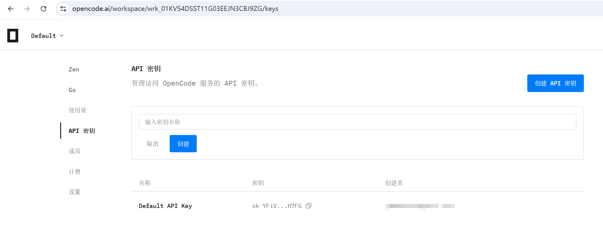
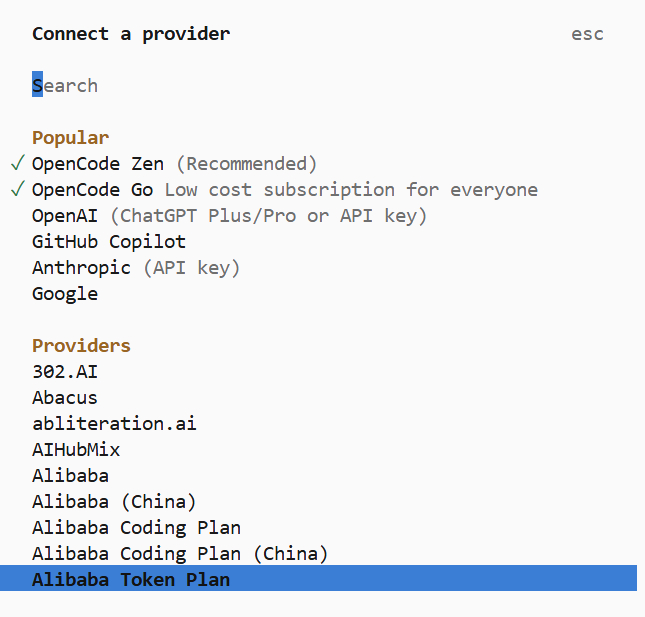
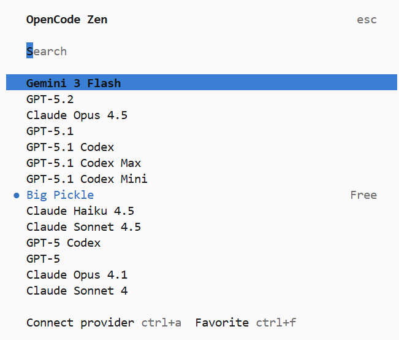
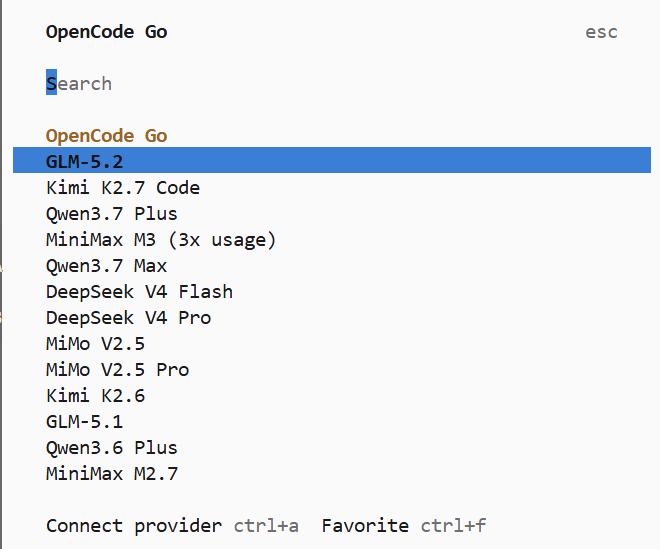

# 第2讲：环境搭建 — 工欲善其事，必先利其器

> 目标：亲手装好工具链，然后交给 Claude 完成后续所有配置

> 面向：零编程基础人员

> ⚠️ 免责声明：本课程内容为教学演示，所有分析仅为技术面和基本面的客观数据呈现，不构成任何投资建议。投资有风险，入市需谨慎。

---

## 课前准备：安装 7 个工具

按顺序装好，每个只需几分钟-到一个钟：

> 工欲善其事，必先利其器。

本讲需要安装以下工具（按安装顺序）：

| 工具 | 用途 | 必装？ |
|------|------|--------|
| **WSL**（Windows 用户） | 给 Win 装 Linux 环境，跑服务端程序 | Windows 必装，Mac 跳过 |
| **VSCode** | 代码编辑器，看代码、发指令给 AI | ✅ 必装 |
| **Claude Code / OpenCode** | AI 编程 CLI 工具，替你写代码 | ✅ 二选一必装 |
| **Miniconda** | Python 环境管理器 | ✅ 必装 |
| **Git** | 版本控制，防 AI 乱改 | ✅ 必装 |
| **MySQL** | 数据库，存股票数据 | ✅ 必装 |

每个装好只需几分钟，跟着下面步骤来就行。

### 2.1 VSCode（代码编辑器）

**做什么：** 去 code.visualstudio.com 下载安装。

**为什么装这个：** 虽然最后代码都是 AI 写的，但你需要一个地方看到代码长什么样，也能把指令发给 AI。

#### VSCode 是什么

Visual Studio Code（简称 VSCode）是微软开发的免费开源代码编辑器，2015 年发布后迅速成为全球最流行的开发者工具之一。它基于 **Electron** 框架构建，本质上是跑在 Chrome 内核上的 Web 应用，所以跨平台表现一致（Windows / macOS / Linux 体验几乎一样）。

核心特点：

- **轻量快速**：启动秒开，占用内存远低于传统 IDE
- **插件生态丰富**：Marketplace 上有数万款插件，装什么像什么——装 Python 插件就能写 Python，装 Vue 插件就能写前端
- **内置 Git 支持**：可视化对比、提交、推送，不用记 Git 命令
- **终端集成**：编辑器底部直接打开命令行，不用来回切换窗口
- **AI 集成**：配合 Claude Code / OpenCode 插件，编辑器里直接跟 AI 对话

#### VSCode vs 传统 IDE（Eclipse / IntelliJ IDEA）

很多初学者分不清编辑器（Editor）和集成开发环境（IDE）的区别，用个类比就好理解：

> **编辑器 = 记事本++** —— 轻巧、启动快、干什么都行但需要自己装工具
> **IDE = 瑞士军刀套装** —— 功能全面但笨重，每个语言有各自的专用工具

Eclipse 和 IntelliJ IDEA 是上一个时代的产物——它们是面向 Java 企业开发的重型 IDE，启动慢、内存高、配置复杂。AI 编程时代，这些 IDE 的智能提示、代码生成、重构工具都变得多余了——AI 替你写代码，你只需要一个轻量、终端集成好、AI 插件丰富的编辑器。

VSCode 就是 AI 编程时代的事实标准编辑器：秒开、跨平台、插件生态丰富、内嵌终端与 AI CLI 工具无缝配合。本课程选 VSCode 的理由很简单——AI 编程不需要重型 IDE，一个编辑器 + AI 就够了。

#### Cursor 和 Trae：站在 VSCode 肩膀上的 AI 编辑器

Cursor 和 Trae（字节跳动出品）是两个基于 VSCode 二次开发的 AI 原生编辑器。它们不是跟 VSCode 竞争的新工具，而是 **把 VSCode 的壳保留、把 AI 能力深度嵌入内核** 的产品。

**关系类比：**

> VSCode = 毛坯房 —— 提供基本结构，装修（插件）自己来
> Cursor / Trae = 精装房 —— 基于同样结构，但 AI 部分已经精装好了

| 对比维度 | VSCode + Claude Code 插件 | Cursor | Trae（字节跳动） |
|---------|--------------------------|--------|-----------------|
| **AI 编程集成** | 装插件，有图形对话面板，也可终端跑 CLI | AI 内嵌内核，自动感知上下文 | AI 内嵌内核，自动感知上下文 |
| **学习曲线** | 低，和 VSCode 一致 | 零门槛，开箱即用 | 零门槛，全中文界面 |
| **收费** | 按 API 用量付费 | $20/月起 | **免费**（字节跳动补贴） |
| **适用人群** | 想掌握 CLI 同时享受编辑器内 AI 对话 | 愿意付费换 AI 体验的开发者 | 不想折腾配置的开发者 |

**核心关系总结：**

- **Cursor** 和 **Trae** 本质上是 VSCode 的 "AI 定制版" —— 它们保留了 VSCode 的界面、快捷键、插件生态，所以如果你会用 VSCode，上手这两者零成本
- VSCode 自己也在快速追赶 AI 能力（GitHub Copilot 原生集成、Claude Code 插件），但 Cursor/Trae 在 AI 深度集成上仍领先一步
- 字节的 **Trae** 是国内用户最省心的选择 —— 免费、中文、不需要配置任何网络环境，开箱即用


### 2.2 AI 工具选择（二选一）

**两个都能完成本课程的全部任务**，选一个就行。

---

#### 2.2a Claude Code

**它是什么：** Anthropic 官方推出的 AI 编程 CLI 工具，直接在终端里运行。给它指令，它就能读写文件、执行命令、操作 Git。

**收费方式：** 按量计费（API 调用量 × 模型单价），控制权在你自己手上。

**安装方法：**
```bash
npm install -g @anthropic-ai/claude-code
```

**配置 API Key（按这个顺序做，否则 Claude 没法用）：**
1. 去 DeepSeek 官网注册账号，获取 API Key
2. 在 WSL 里创建配置文件（参考 `参考文档/windows 配置claude code-wsl版.md`）：
   ```bash
   mkdir -p ~/.claude
   vi ~/.claude/settings.json
   ```
   填入你的 API Key，参考文档里有完整格式
3. 验证是否成功：
   ```bash
   claude --version        # 应该显示版本号
   claude "你好"           # 测试能否正常回复
   ```

> ⚠️ **注意：** 只有配好 API Key 后，`claude` 命令才能正常使用。不要跳过配置步骤直接试。

---

#### 2.2b OpenCode

**它是什么：** 开源 AI 编程 CLI 工具，兼容 Claude Code 的大部分功能。由社区维护，支持更多模型选择。官网：https://opencode.ai

**收费方式：** 首月 $5，之后 $10/月包月，无限次使用。注意：基础包月费不含模型调用费，实际使用 DeepSeek 等模型会产生 Token 费用，但很低。

**安装方法（两条命令都要执行）：**
```bash
npm i -g opencode-ai
npm install -g oh-my-opencode
```
第一条安装 OpenCode 本体，第二条安装 **oh-my-opencode**（OpenCode 的增强插件系统）。oh-my-opencode 提供：
- **Skills 技能市场** — 安装利弗莫尔、Minervini 等人物视角
- **MCP 服务** — 让 OpenCode 连接外部工具
- **多模型切换** — DeepSeek / GPT / Claude 等随意切换

安装后运行 `opencode` 即可启动。

**配置 API Key：**
去 https://opencode.ai 注册账号获取 API Key，把 Key 配置到环境变量或 OpenCode 配置文件中（官方文档有说明）。


**新手建议：** 选 OpenCode，费用固定无压力。熟悉后可以试试 Claude Code 对比效果。

> ⚠️ **核心要点：** 无论选哪个工具，**都要先准备好 API Key 后再测试命令**。没配 Key 之前命令行会报错，这是正常的。

### 2.3 VSCode 插件安装（Claude Code / OpenCode）

安装完 AI 工具后，给 VSCode 装上对应插件，方便在编辑器里直接跟 AI 对话：

**Claude Code 插件：**
在 VSCode 扩展商店搜索 **"Claude Code"** 安装即可。装完后 VSCode 左侧会出现 Claude 图标，点击可打开对话面板。

**OpenCode 插件：**
在 VSCode 扩展商店搜索 **"OpenCode"** 安装。装完后可用快捷键 `Ctrl+Shift+P` → 输入 `OpenCode: Start Session` 启动对话。

> 插件不是必须的——CLI 版已经够用。但装插件后可以在编辑器里直接选代码发给 AI，体验更流畅。

### 2.4 模型配置与选择

两个 AI 工具分别适配不同的模型，按你选的工具配置即可：

#### Claude Code → DeepSeek

Claude Code 原生支持通过 API 地址切换模型。配置 `~/.claude/settings.json` 指向 DeepSeek 的 Anthropic 兼容接口：

```json
{
  "env": {
    "ANTHROPIC_API_KEY": "sk-你的key",
    "ANTHROPIC_BASE_URL": "https://api.deepseek.com/anthropic",
    "ANTHROPIC_MODEL": "deepseek-v4-pro"
  }
}
```

> DeepSeek 性价比高，适合日常开发。更多模型参数参考 `参考文档/windows 配置claude code-wsl版.md`。

#### OpenCode → 多模型切换

OpenCode 通过 `opencode connect` 命令或配置文件切换模型，支持更丰富的选择：

- **big-pickle** — OpenCode 默认模型，综合能力强
- **Qwen3.7plus / Qwen-Max** — 通义千问系列，中文理解优秀
- **GLM-4** — 智谱 GLM 系列，适合长文本任务





**配置方式：**

```bash
# 启动交互式模型选择
opencode connect
```

或者在配置文件中直接指定模型。

> **新手建议：** DeepSeek 和通义千问都是性价比之选，先用默认模型跑通流程，后续再对比不同模型效果。

---

### 2.5 Miniconda

Python 环境管理器。装完就不用管了，后面的 Python 环境 Claude 会自动配置。

安装步骤参考：
- Linux / WSL 用户 → `参考文档/miniconda安装-linux.md`
- Windows 用户 → `参考文档/miniconda安装-windows.md`

### 2.6 Git

版本控制工具，帮你的代码做"后悔药"——改错了可以回到上一个版本。

安装步骤参考：
- Linux / WSL 用户 → `参考文档/git安装-linux.md`
- Windows 用户 → `参考文档/git安装-windows.md`

### 工具检查清单

装完以上工具后，你应该有：
- [ ] VSCode 已安装（Windows 用户 WSL 已装）
- [ ] Claude Code 或 OpenCode 已安装并配置好
- [ ] Miniconda 已安装
- [ ] Git 已安装

**这些工具的配置细节你不用管，Claude 会帮你搞定。**

---

## 2.7 安装 MySQL 服务

安装 MySQL 8.0 服务器并创建 `ai_trading` 数据库。

**方法一：让 AI 帮你装（推荐）**
打开终端，让 Claude 或 OpenCode 帮你完成：

> "帮我安装 MySQL 8.0，创建 ai_trading 数据库（字符集 utf8mb4，排序规则 utf8mb4_unicode_ci），root 密码设为 aitrading123。"

AI 会自动检测你的系统，执行对应的安装步骤。

**方法二：手动安装**
参考文档：
- Linux / WSL 用户 → `参考文档/mysql安装-linux.md`
- Windows 用户 → `参考文档/mysql安装-windows.md`

手动安装完成后，执行：

```bash
# 启动 MySQL 服务
mysql -u root -p
```

进入 MySQL 后，创建数据库：

```sql
CREATE DATABASE ai_trading CHARACTER SET utf8mb4 COLLATE utf8mb4_unicode_ci;
```

完成后退出 MySQL：

```sql
exit
```

**验证：** 确认数据库已创建成功：

```bash
mysql -u root -p -e "SHOW DATABASES;"
```

看到 `ai_trading` 在列表中即可。

> **记下你的 MySQL 连接信息**（用户名、密码、端口），后续步骤中 Claude 会用到。

**用 DBeaver 检查（可视化确认）：**
安装 DBeaver（参考 `参考文档/dbeaver安装与连接mysql.md`），用以下信息连接：
- 主机：`localhost`
- 端口：`3306`
- 用户名：`root`
- 密码：`aitrading123`

连接成功后，在左侧数据库列表应能看到 `ai_trading` 数据库。

## 动手环节

装好所有工具后，告诉 Claude 一句，确认环境已经就绪，后续第 3 讲会给出完整指令，一口气完成项目搭建和数据导入。

> "帮我确认一下环境：MySQL 能连上、conda aitrading环境 能用、git 已安装。"

**预期结果：** 环境就绪，进入第 3 讲。
