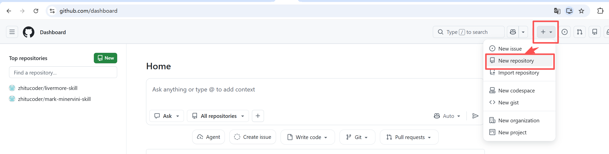
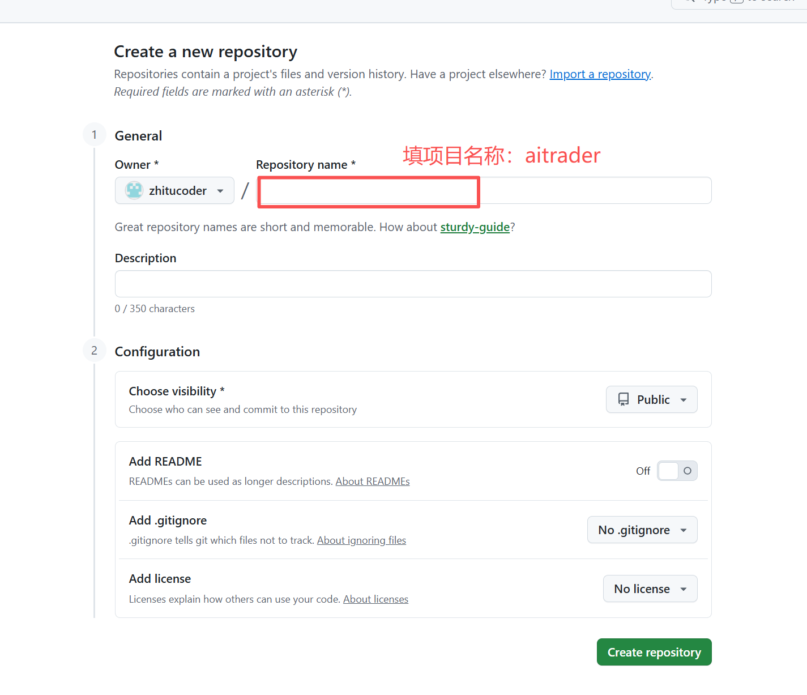

# 第5讲：代码管理 — 告诉 Claude 做版本控制

> 目标：用 AI 完成 Git 初始化、提交和项目管理
> 面向：零编程基础人员
> ⚠️ 免责声明：本课程内容为教学演示，所有分析仅为技术面和基本面的客观数据呈现，不构成任何投资建议。投资有风险，入市需谨慎。

---

## 5.1 GitHub 介绍与项目创建

### 什么是 GitHub

GitHub 是代码的云端仓库。简单说：**全世界的程序员都在上面存代码。**

目前全球有 **1.5 亿+ 开发者**使用 GitHub，托管了 **1 亿+ 个项目**。几乎所有你听过的软件（Linux、Python、React 等）都放在 GitHub 上。

**为什么选 GitHub 而不是其他平台：**

| 原因 | 说明 |
|------|------|
| **行业标准** | 不管大厂小厂、个人项目，源码基本都在 GitHub |
| **AI 工具原生支持** | Claude Code / OpenCode 直接对接 GitHub，提交流程一句话搞定 |
| **免费** | 私有仓库不限量，个人用户完全免费 |
| **开源生态** | 全球最大的开源社区，你想找的任何项目都在上面 |
| **当作品集** | 你做的量化系统挂上去就是简历，面试直接给链接 |

国内也有替代品 Gitee（码云）。本课程推荐 GitHub。

### 注册 GitHub 账号

注册步骤参考 `参考文档/github账号注册.md`，全程 5 分钟，只需要一个邮箱。

### 在 GitHub 上创建新项目仓库

1. 登录 GitHub 点右上角 **"+" → "New repository"**

2. 输入仓库名，选 Private（公开或私有），其他默认

3. 点击 **"Create repository"**

> ⚠️ 创建空仓库就行，**不要勾选** "Add a README" "Add .gitignore" 等选项。空仓库方便第一次从本地推送已有代码。

---

## 5.1 Git 基础概念

你只需要理解三个词：

| 概念 | 大白话 | 怎么告诉 Claude |
|------|--------|----------------|
| **commit** | 保存当前版本（拍张快照） | "帮我保存一下当前的代码" |
| **branch** | 另开一条线做实验 | "帮我创建一个分支试试新功能" |
| **push** | 把代码传到云端备份 | "帮我把代码传到 GitHub 上" |

**不知道怎么写命令？** 用自然语言告诉 Claude，它会翻译成 Git 命令。

---

## 5.2 让 Claude 初始化仓库

告诉 Claude：

> "帮我把这个项目初始化为 Git 仓库，写一个 .gitignore 文件（排除 Python 缓存、数据库文件、环境变量等），然后做第一次提交，提交信息写'项目初始化：创建 ai-trading A 股量化系统基础框架'。"

**Claude 会做什么：**
- 执行 `git init`
- 创建适当的 .gitignore
- 添加所有文件并提交

---

## 5.3 自然语言做版本管理

日常开发中，用自然语言告诉 Claude 你想做什么：

**保存当前进度：**
> "帮我提交改了数据采集和策略筛选的新代码，提交信息写'完成日K线数据导入和基础策略筛选功能'。"

**回退到之前的版本：**
> "我改了策略筛选但发现改错了，帮我回退到昨天的版本。"

**查看修改了什么：**
> "帮我看看这次改了哪些文件，对比一下和之前版本的差异。"

**Claude 会自动执行对应的 Git 命令，你只需要说需求。**

---

## 5.4 代码审查交给 AI

告诉 Claude：

> "检查我这次改了什么内容，有没有明显的 bug 或者写得不好的地方。"

**Claude 会做什么：**
- 查看本次改动（git diff）
- 分析代码逻辑
- 指出问题并建议修复

---

## 5.5 项目结构规范

每次接手项目的 AI 都需要了解项目上下文。

告诉 Claude：

> "帮我维护 CLAUDE.md 文件，每次新增功能模块时，把新模块的路径和功能描述更新到这个文件里。"

**这样做的效果：**
- 每个新 AI 打开项目时自动读取
- 不需要重复告诉 AI 项目背景
- 协作时所有人都了解项目结构

---

## 5.6 一句话关联 GitHub 仓库

**告别学 git 命令、告别鼠标点图形界面。关联和提交全程交给 AI。**

### 新建仓库首次关联

在 GitHub 上建好一个空仓库后，告诉 Claude：

> "帮我把本地代码关联到 GitHub 仓库 git@github.com:你的用户名/仓库名.git，然后推送到远程。"

**Claude 会做什么：**
- 添加远程仓库地址
- 推送本地代码到 GitHub
- 设置上游分支关联

如果还没配置 SSH 免密，它会提醒你先配一下（参考 `参考文档/github配置ssh-linux.md`）。

### 已有仓库换地址

> "我的远程仓库地址换了，帮我把远程地址改成 git@github.com:新用户名/新仓库.git"

### 克隆别人仓库

> "帮我把 https://github.com/别人的仓库.git 克隆下来"

---

## 5.7 一句话提交代码

**告别学命令、告别写注释。AI 全程代劳。**

你只需要说：
> "帮我把代码提交并推送到 GitHub。"

**Claude 会自己看改了哪些文件、自动生成合适的提交信息，你检查一下就行。**

### 各种场景

| 场景 | 一句话指令 |
|------|-----------|
| 首次推送 | "帮我把代码推送到 GitHub 远程仓库" |
| 日常提交 | "帮我把代码提交并推送" |
| 紧急修复 | "修了一个紧急 bug，帮我提交并推送" |

**不需要学：** ~~`git add` / `git commit` / `git push` / 写提交信息~~

---

## 动手环节

### 第一次：关联远程仓库并推送到 GitHub

先确认 GitHub 上建好了一个空仓库（参考 `参考文档/github账号注册.md`），然后告诉 AI：

> "帮我把本地代码关联到远程仓库 git@github.com:zhitucoder/mark-minervini-skill.git，用密钥 ~/.ssh/id_ed25519_github.pub 认证，然后推送到远程。"

以后日常提交只需要说 **"提交代码"** ，AI 自动看改了什么、写注释、提交推送。

如果项目代码是英文的，可以加这个指令让 AI 用中文写注释：

> "把这条规则写到 CLAUDE.md 里：所有 git 提交信息用中文写。"

之后每次 AI 都会自动用中文写提交信息。

### 日常提交

告诉 AI：
> "提交代码"

**预期结果：** AI 自动执行 git add → git commit（自动生成中文注释）→ git push，你只需要看一眼提交信息是否正确。
