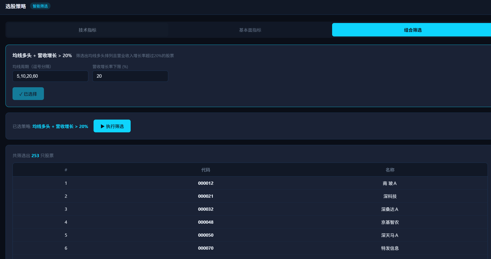
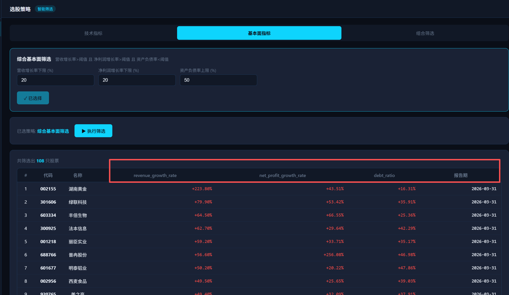
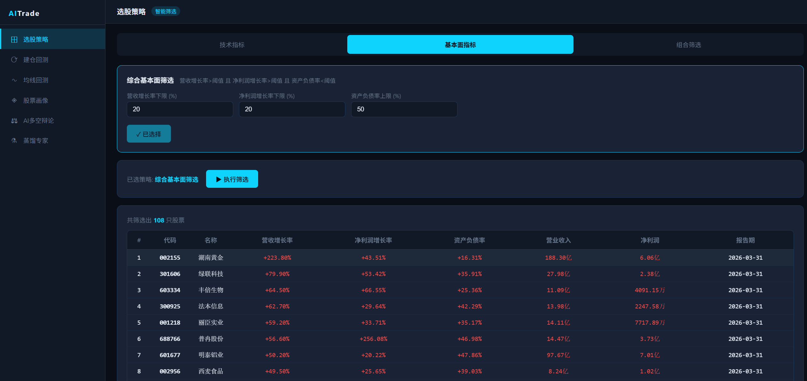

# 第6讲：股票筛选 — 描述选股逻辑，AI 实现策略

> 目标：用自然语言描述选股条件，Claude 自动生成筛选引擎
> 面向：零编程基础人员

> ⚠️ 免责声明：本讲内容为教学演示，策略筛选仅为技术指标和财务指标的客观展示，不构成任何投资建议。投资有风险，入市需谨慎。

---

## 6.1 技术指标

告诉 Claude：

> "帮我写几个技术指标的计算函数，能从数据库读取日K线数据，然后算出：
> - MA5、MA10、MA20、MA60（N日均线价格）
> - RSI14（相对强弱指标）
> - 判断当前是否处于上升趋势
> - 检测是否正在主升浪
> 
> 这些指标是后续选股的基础，放在单独的模块里。"

**Claude 会做什么：**
- 从 daily_prices 表读取收盘价
- 计算均线、RSI 等技术指标
- 返回指标数值和判断结果

**你不需要理解指标怎么算，只需要知道它们代表什么：**
- **均线多头排列**：短期均线 > 中期均线 > 长期均线 → 趋势向好
- **RSI > 70**：短期超买，可能要回调
- **RSI < 30**：短期超卖，可能要反弹

---

## 6.2 基本面指标

告诉 Claude：

> "从 fin_ratios 表里读取最新的财务比率数据，帮我筛选出：
> - 营收增长率（revenue_growth_rate）> 20%
> - 净利润增长率（net_profit_growth_rate）> 20%
> - 资产负债率（debt_asset_ratio）< 50%
> 
> 把这些条件做成可配置的，以后修改条件直接改参数就行。"

**Claude 会做什么：**
- 写一条 SQL 查询，从 fin_ratios 表读取最新报告期的数据
- 按照你设置的条件过滤
- 输出符合条件的股票列表

> 💡 通达信自带的比率表（`fin_ratios`）已经包含营收增长率、净利润增长率、资产负债率等指标，无需额外计算。`financial_metrics` 表已废弃。

---

## 6.3 策略框架

告诉 Claude：

> "帮我设计一个插件化的策略框架：
> - 每个策略是一个独立的文件
> - 新增策略不需要改已有的代码
> - 策略可以组合多个条件
> - 筛选结果包含股票代码和每个条件的得分"

**Claude 会做什么：**
- 设计策略基类和注册机制
- 实现策略的自动发现
- 创建示例策略

**这个框架的意义：** 以后你想加新的选股条件，只需要新建一个文件，告诉 Claude 你的选股逻辑，系统自动识别。

---

## 6.4 组合筛选

告诉 Claude：

> "帮我做一个页面，上面可以：
> 1. 选择一个策略
> 2. 点击执行筛选
> 3. 显示筛选结果（股票代码、名称、各项得分）
> 4. 点击某支股票能看到它的详细数据"

**你将在浏览器中看到：**
```
┌──────────────────────────────────────────────────┐
│  策略筛选         [趋势价值策略 ▼]  [开始筛选]    │
├──────────────────────────────────────────────────┤
│  结果：共 45 支股票符合条件                       │
│                                                  │
│  股票代码 │ 名称   │ 趋势得分 │ 财务得分 │ 操作   │
│  600519   │ 贵州茅台│ 85      │ 92      │ [详情] │
│  000858   │ 五粮液 │ 78      │ 88      │ [详情] │
│  ...      │ ...    │ ...     │ ...     │ ...    │
└──────────────────────────────────────────────────┘
```

---

## 技术约束

| 约束 | 说明 |
|------|------|
| 只能查询已有字段 | 数据库中有什么数据，就用什么数据筛选 |
| 无未来数据 | 技术指标只能用截止到当天的数据，不能用未来的 |
| 停牌处理 | 停牌的股票跳过指标计算 |

---

## 动手环节

告诉 Claude：

> "

我要做一个股票分析系统，做股票筛选、回测、股票分析等功能。
先实现 选股策略页面

选股策略页面：支持多种选股策略，
         1. 技术指标选股（策略包括：均线多头排列等，支持扩展）
         2. 基本面指标（  营收增长率（revenue_growth_rate）> 20%
			> - 净利润增长率（net_profit_growth_rate）> 20%
			> - 资产负债率（debt_asset_ratio）< 50%））
		 3. 筛选出均线多头排列且营收增长超过 20% 的股票
建仓回测页面：先空实现，左侧导航栏
均线回测页面：先空实现，左侧导航栏
股票画像页面：先空实现，左侧导航栏
AI多空辩论页面：先空实现，左侧导航栏
蒸馏专家页面： 先空实现，左侧导航栏

技术要求：fastAPI 后端 +  前端（暗色科技风）， 无构建(Vue 3  SPA， CDN 单文件, index.html, app.js + css) 
conda 环境： /home/rick/miniconda3/envs/aitrading
技术：Python 语言，conda 环境 /home/rick/miniconda3/envs/aitrading；
FastAPI 后端 + Vue 3 前端（暗色科技风），uvicorn方式启动项目；
数据库 MySQL（localhost:3306，root/aitrading123）；
通达信安装目录 /mnt/d/programs/stock
web端口:9000

"

**预期结果：** 页面上显示符合条件的股票列表，每支股票附带技术面和基本面得分。以上仅为教学演示，不构成投资建议。


# 修改

第一次修改：
1.页面表格需要居中对齐
2. 技术指标页面，代码和名称在表格里面出现两次了，只要出现一次
3. 基本面指标里面，营收增长率、净利润增长率、资产负债率 
   可以同时选，这个3个选项放到同一栏就行。

# 第二次修改
选股策略页面的表格，应该要有一些内容啊，而不是只有股票代码和股票名称



# 第三次修改
表格的列头需要用中文：revenue_growth_rate	net_profit_growth_rate	debt_ratio，这些改中文， 所有表格需要居中显示


修改前



## 第3次修改
提出新的需求
基本面页面和组合筛选页面，增加股票市值、市盈率，总收入、净利润、汇报日期 指标， 按照最新的季度报告的数据显示

修改后：



## 页面美观
换更炫酷的风格

# /init生成 CLAUDE.md  或 AGENT.md文件

# 如何避免AI乱改
