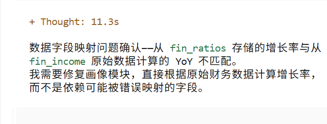
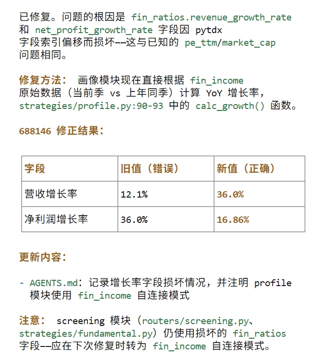
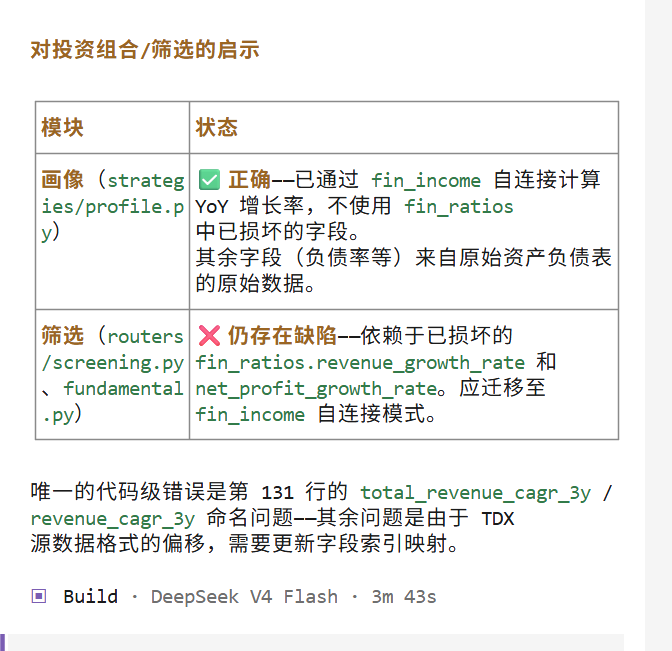

# 第8讲：股票画像 — 描述评价维度，AI 生成标签体系

> 目标：说出"帮这支股票打标签"，AI 自动从技术面和基本面评分，并判断 SEPA 阶段
> 面向：零编程基础人员

> ⚠️ 免责声明：本讲内容为教学演示，画像标签仅为技术指标和财务指标的客观呈现，不构成任何投资建议。投资有风险，入市需谨慎。

---

## 画像的介绍

股票画像是对一支股票的多维度"体检报告"，从 **技术面**（K线形态、均线、成交量）和 **基本面**（营收、利润、负债）两个角度给股票打分、打标签，并通过 **SEPA 四阶段理论** 判断股票当前处于哪个生命周期阶段（打底→突围→见顶→衰败）。

画像的目标是让用户输入一支股票代码，就能一目了然地看到：
- 这支股票现在"体质"如何（评分）
- 处于什么阶段（S1-S4）
- 有哪些优点和风险（标签）


四阶段理论来源：


---

## 8.1 画像介绍

> 本节概述画像的核心理念，帮助理解后续的技术细节。

画像不是预测涨跌，而是用客观数据给股票做"体检"。体检结果包括：

1. **SEPA 阶段** — 股票当前处于哪个生命周期（基于 Mark Minervini 的四阶段理论）
2. **技术面评分** — 均线形态、RSI、成交量等技术指标的综合评分
3. **基本面评分** — 营收增长率、净利润增长率、资产负债率等财务指标的综合评分
4. **标签体系** — 指标类标签（ind.*）和业务类标签（biz.*），用打勾/打叉的方式直观展示

---

## 8.2 画像框架

设计文档见：`参考文档/画像与标签需求.md` — 这是给 Claude 生成代码的完整需求。

标签分两层：**指标类（ind.*）** 是原始条件（如 MA5 > MA10），**业务类（biz.*）** 由多个指标组合成有业务意义的标签（如"高成长"= 营收增长 > 20% + 净利润增长 > 20%）。

告诉 Claude：

> "读一下 `lession/参考文档/画像与标签需求.md`，按照文档实现完整的股票画像和标签系统。
>
> 具体要求：
> 1. 创建标签定义注册表（`definitions.py`），注册所有指标类（ind.*）和业务类（biz.*）标签
> 2. 实现标签计算引擎：先算指标类标签，再基于指标类标签组合出业务类标签
> 3. 实现 SEPA 阶段分类器，按趋势模板判定阶段
> 4. 提供 API 接口返回每支股票的完整画像
> 5. 做一个画像展示页面，显示阶段、业务标签、指标标签、评分"

**Claude 会做什么：**
- 读取需求文档，理解全部标签定义
- 设计标签系统数据库表和代码结构
- 实现各维度的计算逻辑
- 生成画像 API 和页面

---

## 8.3 SEPA 阶段识别

四阶段理论是画像的核心，详细判定规则见 `参考文档/画像与标签需求.md` 第三节。

| 阶段 | 名称 | 一句话判断 |
|------|------|-----------|
| **S1** | 打底蓄势期 | 不满足其他阶段，默认为 S1 |
| **S2** | 突围加速期 | 满足趋势模板全部 7 条（详见需求文档） |
| **S3** | 见顶派发期 | 不符合 S2/S4，波动加大、放量下跌 |
| **S4** | 衰败下跌期 | 多数时间在 200 日均线下方，持续新低 |

告诉 Claude：

> "按照 `参考文档/画像与标签需求.md` 第三节的阶段判定逻辑，实现 SEPA 阶段分类器。优先判断 S2，然后判断 S4/S3，最后默认 S1。返回阶段和置信度。"

---

## 8.4 技术面标签

技术面指标类标签（ind.*）见需求文档第一节，包含均线、RSI、成交量三类。

告诉 Claude：

> "按照 `参考文档/画像与标签需求.md` 第一节的指标类标签定义，实现所有技术面的 ind.* 标签计算逻辑。包括均线位置、RSI 超买超卖、放量缩量等。每个标签返回 true/false。"

---

## 8.5 基本面标签

基本面分两层：先算指标类（ind.* 数值），再组合成业务类（biz.* 标签）。

告诉 Claude：

> "按照 `参考文档/画像与标签需求.md` 第一、二节的实现基本面标签：
> 1. 先从 fin_ratios 表读取原始数值，计算 ind.revenue_growth、ind.net_profit_growth、ind.debt_ratio 等指标类标签
> 2. 再基于指标组合出业务类标签，如营收增长 > 20% 且 净利润增长 > 20% → biz.high_growth（高成长）
> 3. 所有业务标签在画像页面上满足的打勾"

---

## 8.6 结果可视化

输出格式见 `参考文档/画像与标签需求.md` 第四节。

告诉 Claude：

> "把所有画像结果整合到一个页面上，展示：
> 1. **阶段标识** — 大卡片醒目标注当前处于哪个阶段（S1/S2/S3/S4）+ 置信度
> 2. **三栏评分卡** — 技术面评分、基本面评分、综合评分，每栏显示数字 + 进度条
> 3. **标签列表** — 所有满足条件的技术面和基本面标签
> 4. **对比功能** — 可以选多支股票对比"

**你将在浏览器中看到：**
```
┌──────────────────────────────────────────────┐
│  ️ 股票画像                                   │
│  基于 Minervini 四阶段理论的股票标签体系         │
│                                              │
│  查询股票画像                                   │
│  股票代码：[600150      ]  [▶ 查看画像]         │
│                                              │
│  600150 中国船舶                               │
│                                              │
│  ┌──────────────────────────────────────────┐ │
│  │              当前阶段                      │ │
│  │                S2                        │ │
│  │            突围加速期                      │ │
│  │           置信度 71.4%                    │ │
│  └──────────────────────────────────────────┘ │
│                                              │
│  ┌──────────┐  ┌──────────┐  ┌──────────┐   │
│  │技术面评分 │  │基本面评分 │  │综合评分   │   │
│  │    75    │  │    100   │  │   87.5   │   │
│  │████████░░│  │██████████│  │█████████░│   │
│  └──────────  └──────────┘  └──────────┘   │
│                                              │
│  技术面标签：                                  │
│  ✓ 均线多头排列  ✓ 站上MA20  ✓ RSI 适中        │
│  ✗ 成交量放大                                  │
│                                              │
│  基本面标签：                                  │
│  ✓ 高成长  ✓ 盈利高速增长  ✓ 财务健康           │
│  [对比其他股票]                                │
──────────────────────────────────────────────┘
```

---

## 动手环节

让 Claude 对 3 支不同行业的股票（比如贵州茅台、宁德时代、中国平安）生成完整画像，包括 SEPA 阶段判断。

**预期结果：** 页面上展示每支股票的阶段、技术评分、基本面评分和标签列表，可以直观对比。


# 发现的问题
1. 财务数据不对 
提示AI ： 股票画像的财务数据 营收增长率和净利润增长率 2026-03-31
报告期，我对比 688146 的股票，数据不对



2. 修复 fin_ratios
提示AI： s fin_ratio这个表的 营收增长率和净利润增长率，数据不对，什么原因，其它数据是否正确的，请分析，



3. 给AGENT.md 增加提示
fin_ratios 表数据不可信，不要用
fin_income 表数据可信


# 提交代码


# 画像筛选功能：根据画像特征查符合特征的股票
 目前已经是实现根据 股票代码 描述股票画像，现在我要对全部A股票，预先做好全部股票的画像，我来根据特征筛选股票。
 由于股票又技术指标是，每日更新，所以画像数据也是每日更新，每天刷新，应该有刷新按钮，和最新数据日期提示，只保留最新的两天数据，手动触发，不要自动触发计算。

股票画像筛选与股票画像，应该是同一个页面(股票画像）的两个tab


# 发现问题(每个人的问题不一样，具体问题具体分析，让ai修正)
告知AI: 点击生成画像，出来一个空页面 